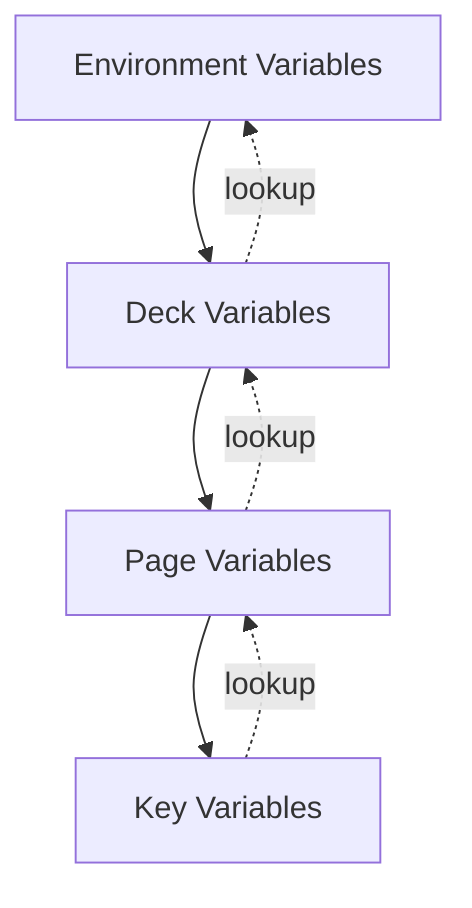

# StreamDeckFS Advanced Features Guide

## Table of Contents

1. [REST API System](#rest-api-system)
2. [Drawing System](#drawing-system)
3. [Advanced Variable Features](#advanced-variable-features)
4. [Advanced Configuration Parameters](#advanced-configuration-parameters)
5. [State Management Files](#state-management-files)
6. [Advanced Event System](#advanced-event-system)
7. [Advanced Image Composition](#advanced-image-composition)
8. [Complete Use Cases](#complete-use-cases)
9. [Hardware Compatibility](#hardware-compatibility)
10. [Troubleshooting & Debugging](#troubleshooting--debugging)
11. [Performance Optimization](#performance-optimization)
12. [Security Considerations](#security-considerations)

---

## REST API System

StreamDeckFS provides a comprehensive **CLI-based API** for programmatic configuration management without manual file editing. This enables automation, scripting, and integration with other tools.

### API Design Philosophy

The API follows a **CRUD pattern** (Create, Read, Update, Delete) for all entities:
- **Deck**: Brightness, current page, model info
- **Pages**: Layout management
- **Keys**: Button configuration
- **Images**: Layer management
- **Texts**: Text line management
- **Events**: Action handlers
- **Variables**: Dynamic values

### Common API Patterns

#### Dry Run Mode

All mutation commands support `--dry-run` to validate without modifying:

```bash
streamdeckfs create-page /path/to/deck --page 5 --dry-run
# Returns: /path/to/deck/PAGE_5
# (validates but doesn't create)
```

#### JSON Output

All read operations return structured JSON:

```bash
streamdeckfs get-page-conf /path/to/deck --page 0
# {"page": 0, "name": null, "overlay": false, "disabled": false}
```

#### Configuration Arguments

Use `-c` / `--conf` to set multiple parameters:

```bash
streamdeckfs set-key-conf /path/to/deck \
  --page 0 \
  --key 0,0 \
  -c disabled false \
  -c name "my_button"
```

### Deck Operations

#### Get Deck Information

```bash
streamdeckfs get-deck-info /path/to/deck
```

**Output:**
```json
{
  "model": "streamdeck_original",
  "nb_rows": 3,
  "nb_cols": 5,
  "web": false
}
```

#### Get/Set Brightness

```bash
# Get current brightness
streamdeckfs get-brightness /path/to/deck
# 75

# Set brightness (0-100)
streamdeckfs set-brightness /path/to/deck --brightness 50
```

Brightness is stored in `.brightness` file and persists across restarts.

#### Get/Set Current Page

```bash
# Get current page
streamdeckfs get-current-page /path/to/deck
# {"number": 0, "name": "main", "is_overlay": false}

# Set current page
streamdeckfs set-current-page /path/to/deck --page 1
streamdeckfs set-current-page /path/to/deck --page main_menu

# Special navigation codes
streamdeckfs set-current-page /path/to/deck --page __first__
streamdeckfs set-current-page /path/to/deck --page __next__
```

### Page Operations

#### List Pages

```bash
# List all renderable pages
streamdeckfs list-pages /path/to/deck

# Include disabled pages
streamdeckfs list-pages /path/to/deck --with-disabled
```

**Output (one JSON object per line):**
```json
{"page": 0, "name": "main", "overlay": false, "disabled": false}
{"page": 1, "name": "settings", "overlay": false, "disabled": false}
{"page": 2, "name": "popup", "overlay": true, "disabled": false}
```

#### Create Page

**With explicit number:**
```bash
streamdeckfs create-page /path/to/deck --page 5
```

**With auto-selection expressions:**

| Expression | Behavior | Example |
|-----------|----------|---------|
| (empty) | First available | `--page ""` → PAGE_0 |
| `N` | Exact number | `--page 5` → PAGE_5 |
| `N+` | First after N | `--page 3+` → PAGE_4 (if 0-3 exist) |
| `N+M` | First between N and M | `--page 3+10` → PAGE_4 (exclusive) |
| `?` | Random available | `--page ?` → PAGE_7 (random) |
| `N?` | Random after N | `--page 5?` → PAGE_8 (random > 5) |
| `?M` | Random before M | `--page ?10` → PAGE_3 (random < 10) |
| `N?M` | Random between | `--page 5?10` → PAGE_7 (5 < x < 10) |

**With configuration:**
```bash
streamdeckfs create-page /path/to/deck \
  --page 10 \
  -c overlay true \
  -c name "overlay_menu"
```

Creates: `PAGE_10;overlay;name=overlay_menu/`

#### Copy/Move Page

```bash
# Copy page 0 to page 5 (with all content)
streamdeckfs copy-page /path/to/deck \
  --page 0 \
  --to-page 5

# Move page 0 to page 10 (rename)
streamdeckfs move-page /path/to/deck \
  --page 0 \
  --to-page 10 \
  -c name "relocated"
```

#### Delete Page

```bash
streamdeckfs delete-page /path/to/deck --page 5

# With dry-run
streamdeckfs delete-page /path/to/deck --page 5 --dry-run
# /path/to/deck/PAGE_5 (would be deleted)
```

#### Get Page Configuration

```bash
# Get all configuration
streamdeckfs get-page-conf /path/to/deck --page 0

# Get specific fields
streamdeckfs get-page-conf /path/to/deck --page 0 \
  -c overlay \
  -c name
```

#### Set Page Configuration

```bash
streamdeckfs set-page-conf /path/to/deck \
  --page 0 \
  -c overlay true \
  -c name "main_menu"

# Returns new path
# /path/to/deck/PAGE_0;overlay;name=main_menu
```

### Key Operations

#### List Keys

```bash
streamdeckfs list-keys /path/to/deck --page 0

# Include disabled
streamdeckfs list-keys /path/to/deck --page 0 --with-disabled
```

#### Create Key

**With explicit position:**
```bash
streamdeckfs create-key /path/to/deck \
  --page 0 \
  --key 2,3
```

**With auto-selection:**

| Expression | Behavior |
|-----------|----------|
| `+` | First available key (row by row) |
| `?` | Random available key |
| `R,C` | Exact position (row, column) |

```bash
# First available
streamdeckfs create-key /path/to/deck --page 0 --key +

# Random position
streamdeckfs create-key /path/to/deck --page 0 --key ?

# With configuration
streamdeckfs create-key /path/to/deck \
  --page 0 \
  --key 0,0 \
  -c name "power_button" \
  -c disabled false
```

#### Copy/Move Key

```bash
# Copy key within same page
streamdeckfs copy-key /path/to/deck \
  --page 0 \
  --key 0,0 \
  --to-key 1,1

# Copy to different page
streamdeckfs copy-key /path/to/deck \
  --page 0 \
  --key 0,0 \
  --to-page 1 \
  --to-key +

# Move key
streamdeckfs move-key /path/to/deck \
  --page 0 \
  --key 0,0 \
  --to-page 1 \
  --to-key 2,2
```

#### Get/Set Key Configuration

```bash
# Get path
streamdeckfs get-key-path /path/to/deck --page 0 --key 0,0

# Get configuration
streamdeckfs get-key-conf /path/to/deck --page 0 --key 0,0

# Set configuration
streamdeckfs set-key-conf /path/to/deck \
  --page 0 \
  --key 0,0 \
  -c name "volume_up" \
  -c disabled false
```

### Image Layer Operations

#### Create Image Layer

```bash
# Create empty image layer
streamdeckfs create-image /path/to/deck \
  --page 0 \
  --key 0,0 \
  -c layer 1

# Create with symlink to existing image
streamdeckfs create-image /path/to/deck \
  --page 0 \
  --key 0,0 \
  --link /path/to/icon.png \
  -c layer 5 \
  -c opacity 80
```

#### Copy/Move Image Layer

```bash
# Copy layer to another key
streamdeckfs copy-image /path/to/deck \
  --page 0 \
  --key 0,0 \
  --layer 1 \
  --to-page 0 \
  --to-key 1,1

# Move layer
streamdeckfs move-image /path/to/deck \
  --page 0 \
  --key 0,0 \
  --layer 1 \
  --to-key 2,2
```

#### Set Image Configuration

```bash
streamdeckfs set-image-conf /path/to/deck \
  --page 0 \
  --key 0,0 \
  --layer 1 \
  -c opacity 50 \
  -c colorize "#FF0000" \
  -c rotate 90
```

### Text Line Operations

Similar API to image layers:

```bash
# Create text line
streamdeckfs create-text /path/to/deck \
  --page 0 \
  --key 0,0 \
  -c line 0 \
  -c text "Hello World" \
  -c color "#FFFFFF" \
  -c size 14

# Copy text line
streamdeckfs copy-text /path/to/deck \
  --page 0 \
  --key 0,0 \
  --line 0 \
  --to-key 1,1

# Set text configuration
streamdeckfs set-text-conf /path/to/deck \
  --page 0 \
  --key 0,0 \
  --line 0 \
  -c text "Updated" \
  -c align center \
  -c fit true
```

### Event Operations

#### Create Event

Events can be attached to **deck**, **page**, or **key**:

```bash
# Deck event (no page/key specified)
streamdeckfs create-event /path/to/deck \
  --event start \
  -c command "echo 'Deck started'"

# Page event (page specified, no key)
streamdeckfs create-event /path/to/deck \
  --page 0 \
  --event start \
  -c command "echo 'Page loaded'"

# Key event (page and key specified)
streamdeckfs create-event /path/to/deck \
  --page 0 \
  --key 0,0 \
  --event press \
  -c command "playerctl play-pause"
```

**Event kinds:**
- Deck/Page: `start`, `end`
- Key: `press`, `release`, `longpress`

#### Advanced Event Configuration

```bash
# Long press with wait time
streamdeckfs create-event /path/to/deck \
  --page 0 \
  --key 0,0 \
  --event longpress \
  -c wait 1000 \
  -c command "shutdown now"

# Conditional event
streamdeckfs create-event /path/to/deck \
  --page 0 \
  --key 0,0 \
  --event press \
  -c if '$VOLUME > 50' \
  -c then "volume_warning_page" \
  -c else "volume_ok_page"

# Event with variable update
streamdeckfs create-event /path/to/deck \
  --page 0 \
  --key 0,0 \
  --event press \
  -c "VAR_COUNTER" '${VAR_COUNTER + 1}'
```

#### Copy/Move Event

```bash
# Copy event to another key
streamdeckfs copy-event /path/to/deck \
  --page 0 \
  --key 0,0 \
  --event press \
  --to-key 1,1

# Copy with different event kind
streamdeckfs copy-event /path/to/deck \
  --page 0 \
  --key 0,0 \
  --event press \
  --to-event release
```

### Variable Operations

#### Create Variable

```bash
# Deck-level variable
streamdeckfs create-var /path/to/deck \
  --var GLOBAL_STATE \
  -c value "idle"

# Page-level variable
streamdeckfs create-var /path/to/deck \
  --page 0 \
  --var PAGE_MODE \
  -c value "normal"

# Key-level variable
streamdeckfs create-var /path/to/deck \
  --page 0 \
  --key 0,0 \
  --var LOCAL_COUNT \
  -c value 0
```

#### Get Variable Value

```bash
# Get resolved variable value (with scope resolution)
streamdeckfs get-var-value /path/to/deck \
  --page 0 \
  --key 0,0 \
  --var COUNTER
# 42
```

The API searches in order: key → page → deck → environment.

#### Set Variable Configuration

```bash
# Simple value
streamdeckfs set-var-conf /path/to/deck \
  --var COUNTER \
  -c value 100

# Conditional variable
streamdeckfs set-var-conf /path/to/deck \
  --var COLOR \
  -c if '$ACTIVE' \
  -c then "#00FF00" \
  -c else "#FF0000"

# File-based variable
streamdeckfs set-var-conf /path/to/deck \
  --var CONFIG \
  -c file "/path/to/config.json"
```

### API Usage Patterns

#### Scripted Deck Creation

```bash
#!/bin/bash
DECK_DIR="/path/to/my_deck"

# Create pages
streamdeckfs create-page "$DECK_DIR" --page 0 -c name "main"
streamdeckfs create-page "$DECK_DIR" --page 1 -c name "settings"

# Create keys on main page
for row in {0..2}; do
  for col in {0..4}; do
    streamdeckfs create-key "$DECK_DIR" --page 0 --key "$row,$col"
  done
done

# Add events to first key
streamdeckfs create-event "$DECK_DIR" \
  --page 0 --key 0,0 \
  --event press \
  -c command "echo 'Button pressed'"
```

#### Bulk Configuration Update

```bash
# Update all keys on a page
streamdeckfs list-keys /path/to/deck --page 0 | \
while read -r key_conf; do
  key_pos=$(echo "$key_conf" | jq -r '"\(.row),\(.col)"')
  streamdeckfs set-key-conf /path/to/deck \
    --page 0 \
    --key "$key_pos" \
    -c disabled false
done
```

#### Configuration Backup

```bash
# Export deck configuration
streamdeckfs get-deck-info /path/to/deck > deck.json
streamdeckfs list-pages /path/to/deck > pages.jsonl
streamdeckfs list-keys /path/to/deck --page 0 > keys_p0.jsonl
```

---

## Drawing System

StreamDeckFS includes a powerful **vector drawing system** for creating dynamic graphics without external image files. Drawings are resolution-independent and can use variables for dynamic updates.

### Drawing Primitives

All drawings are specified as `IMAGE` layers with `draw=` parameter.

#### Line Drawing

```
IMAGE_1;draw=line;coords=0,50%,100%,50%;outline=white;width=3
```

**Parameters:**
- `coords=x1,y1,x2,y2,...` - Line segments (multiple points)
- `outline=color` - Line color
- `width=N` - Line thickness in pixels

**Example: Progress Bar**

```
IMAGE_5;draw=line;coords=0,99%,$VAR_PROGRESS%,99%;outline=#00FF00;width=5
```

Creates horizontal progress bar at bottom, width based on `$VAR_PROGRESS` variable (0-100%).

#### Rectangle Drawing

```
IMAGE_2;draw=rectangle;coords=10,10,90,90;outline=white;fill=blue;width=2
```

**Parameters:**
- `coords=x1,y1,x2,y2` - Top-left and bottom-right corners
- `outline=color` - Border color
- `fill=color` - Fill color (optional)
- `width=N` - Border thickness
- `radius=N` - Corner radius for rounded rectangles

**Example: Rounded Button Background**

```
IMAGE_0;draw=rectangle;coords=5%,5%,95%,95%;fill=#2196F3;width=0;radius=10
```

#### Fill (Shorthand)

```
IMAGE_0;draw=fill;fill=#FF0000
```

Equivalent to: `draw=rectangle;coords=0,0,100%,100%;width=0;fill=#FF0000`

Fills entire key with solid color.

#### Ellipse Drawing

```
IMAGE_3;draw=ellipse;coords=25%,25%,75%,75%;outline=yellow;fill=orange;width=2
```

**Parameters:**
- `coords=x1,y1,x2,y2` - Bounding box
- `outline=color` - Border color
- `fill=color` - Fill color (optional)
- `width=N` - Border thickness

**Example: Circle Indicator**

```
IMAGE_10;draw=ellipse;coords=70%,70%,95%,95%;fill=$VAR_STATUS_COLOR;width=0
```

#### Arc Drawing

```
IMAGE_4;draw=arc;coords=10,10,90,90;angles=0,90;outline=red;width=3
```

**Parameters:**
- `coords=x1,y1,x2,y2` - Bounding box
- `angles=start,end` - Start and end angles (degrees, 0=3 o'clock, counterclockwise)
- `outline=color` - Arc color
- `width=N` - Arc thickness

**Note:** Angles are adjusted internally (-90°) so 0° appears at 12 o'clock.

#### Chord Drawing

```
IMAGE_5;draw=chord;coords=10,10,90,90;angles=0,90;outline=white;fill=blue;width=2
```

Draws arc with straight line connecting endpoints (pie slice without center point).

#### Pie Slice Drawing

```
IMAGE_6;draw=pieslice;coords=20,20,80,80;angles=0,270;fill=green;width=0
```

**Parameters:**
- `coords=x1,y1,x2,y2` - Bounding box
- `angles=start,end` - Angle range
- `fill=color` - Fill color
- `outline=color` - Border color (optional)
- `width=N` - Border thickness

**Example: Progress Pie Chart**

```
IMAGE_10;draw=pieslice;coords=10%,10%,90%,90%;angles=0,$VAR_PERCENT%;fill=#4CAF50;width=0
```

Displays circular progress (0-360°) based on `$VAR_PERCENT` variable.

#### Polygon Drawing

```
IMAGE_7;draw=polygon;coords=50,10,90,50,70,90,30,90,10,50;outline=white;fill=purple;width=2
```

**Parameters:**
- `coords=x1,y1,x2,y2,...` - Polygon vertices (minimum 3 points)
- `outline=color` - Border color
- `fill=color` - Fill color (optional)
- `width=N` - Border thickness

**Example: Triangle Indicator**

```
IMAGE_5;draw=polygon;coords=50%,20%,80%,70%,20%,70%;fill=yellow;width=0
```

#### Points Drawing

```
IMAGE_8;draw=points;coords=10,10,20,20,30,30,40,40;fill=white
```

Draws individual pixels at specified coordinates.

### Coordinate Systems

#### Absolute Pixels

```
coords=10,20,50,60
```

Exact pixel coordinates (device-dependent).

#### Percentage-Based

```
coords=10%,20%,90%,80%
```

Relative to key dimensions (device-independent, recommended).

**Conversion:**
- `50%` on 72px key → 36px
- `100%` on 96px key → 96px

#### Mixed Coordinates

```
coords=0,10%,100%,50
```

Can mix pixels and percentages.

#### Negative Coordinates

```
margin=-5,-5,-5,-5
```

Useful for overflow effects (drawing outside key bounds gets cropped).

### Dynamic Drawing with Variables

#### Animated Progress Bar

```
# Variable updated by timer
VAR_PROGRESS;value=0

# Event updates variable
ON_START;every=100;command=echo $((($VAR_PROGRESS + 1) % 100)) > VAR_PROGRESS

# Drawing uses variable
IMAGE_5;draw=line;coords=0,99%,$VAR_PROGRESS%,99%;outline=#00FF00;width=5
```

#### Multi-State Indicator

```
# Variable determines state
VAR_STATUS;value=idle

# Color based on status
VAR_COLOR;if={"$VAR_STATUS"=="active"};then=#00FF00;elif={"$VAR_STATUS"=="error"};then=#FF0000;else=#FFFF00

# Drawing uses color variable
IMAGE_10;draw=ellipse;coords=70%,5%,95%,30%;fill=$VAR_COLOR;width=0
```

#### Gauge Display

```
# Value from 0-100
VAR_TEMPERATURE;value=75

# Convert to angle (0-180 degrees for half-circle)
VAR_ANGLE;value={$VAR_TEMPERATURE * 180 / 100}

# Draw gauge needle
IMAGE_5;draw=pieslice;coords=10%,50%,90%,90%;angles=0,$VAR_ANGLE;fill=#FF5722;width=0
```

### Layering Drawings

Combine multiple drawings for complex graphics:

```
KEY_0,0/
├── IMAGE_0;draw=fill;fill=#212121                          # Background
├── IMAGE_1;draw=ellipse;coords=10%,10%,90%,90%;outline=#FFF;width=2  # Border
├── IMAGE_2;draw=pieslice;coords=15%,15%,85%,85%;angles=0,$VAR_VALUE%;fill=#4CAF50;width=0  # Progress
└── TEXT;line=0;text=$VAR_VALUE%;align=center;color=#FFF    # Label
```

Result: Circular progress indicator with percentage text.

### Advanced Drawing Techniques

#### Clock Face

```
# Hour markers (12 lines radiating from center)
IMAGE_1;draw=line;coords=50%,5%,50%,15%;outline=#FFF;width=2
IMAGE_2;draw=line;coords=50%,5%,50%,15%;outline=#FFF;width=2;rotate=30
IMAGE_3;draw=line;coords=50%,5%,50%,15%;outline=#FFF;width=2;rotate=60
# ... (10 more lines)

# Hour hand (drawn with pieslice)
IMAGE_20;draw=pieslice;coords=40%,40%,60%,60%;angles=0,$VAR_HOUR_ANGLE;fill=#FFF;width=0
```

#### Battery Level Indicator

```
# Battery outline
IMAGE_1;draw=rectangle;coords=10%,30%,80%,70%;outline=#FFF;width=3
IMAGE_2;draw=rectangle;coords=80%,42%,85%,58%;fill=#FFF;width=0  # Terminal

# Fill based on level
VAR_BATTERY_WIDTH;value={$VAR_BATTERY_LEVEL * 0.65}  # 65% of key width
IMAGE_5;draw=rectangle;coords=12%,32%,$VAR_BATTERY_WIDTH%,68%;fill=$VAR_BATTERY_COLOR;width=0
```

#### VU Meter

```
# 10 segments
IMAGE_10;draw=rectangle;coords=5%,5%,15%,95%;fill=$VAR_VU_1;width=0
IMAGE_11;draw=rectangle;coords=16%,5%,26%,95%;fill=$VAR_VU_2;width=0
# ... (8 more segments)

# Variables set by audio level
VAR_VU_1;if={$VAR_LEVEL > 10};then=#00FF00;else=#333333
VAR_VU_2;if={$VAR_LEVEL > 20};then=#00FF00;else=#333333
# ...
```

---

## Advanced Variable Features

### Expression Evaluation

Variables support **full Python expressions** with safe evaluation:

```
VAR_RESULT;value={($VAR_A + $VAR_B) * $VAR_C / 100}
```

#### Supported Operations

**Arithmetic:**
```
VAR_SUM;value={$VAR_A + $VAR_B}
VAR_DIFF;value={$VAR_A - $VAR_B}
VAR_PRODUCT;value={$VAR_A * $VAR_B}
VAR_QUOTIENT;value={$VAR_A / $VAR_B}
VAR_INT_DIV;value={$VAR_A // $VAR_B}
VAR_MODULO;value={$VAR_A % $VAR_B}
VAR_POWER;value={$VAR_A ** $VAR_B}
```

**Comparison:**
```
VAR_IS_GREATER;value={$VAR_A > $VAR_B}
VAR_IS_EQUAL;value={$VAR_A == $VAR_B}
VAR_IN_RANGE;value={$VAR_MIN <= $VAR_VALUE <= $VAR_MAX}
```

**Logical:**
```
VAR_BOTH_TRUE;value={$VAR_A and $VAR_B}
VAR_EITHER_TRUE;value={$VAR_A or $VAR_B}
VAR_NOT_TRUE;value={not $VAR_A}
VAR_COMPLEX;value={$VAR_A > 10 and ($VAR_B == "active" or $VAR_C < 5)}
```

**String Operations:**
```
VAR_CONCAT;value={"Hello " + $VAR_NAME}
VAR_FORMAT;value={f"Value: {$VAR_NUM:03d}"}
VAR_CONTAINS;value={"error" in $VAR_MESSAGE}
VAR_UPPER;value={"$VAR_TEXT".upper()}
VAR_LENGTH;value={len("$VAR_STRING")}
```

#### Built-in Functions

```
VAR_MAX;value={max($VAR_A, $VAR_B, $VAR_C)}
VAR_MIN;value={min($VAR_LIST)}
VAR_ABS;value={abs($VAR_NEGATIVE)}
VAR_ROUND;value={round($VAR_FLOAT, 2)}
VAR_FORMATTED;value={format($VAR_NUM, "02d")}
```

#### Custom Operators

**Pipe Division (Integer Division with Rounding):**
```
VAR_PERCENT;value={$VAR_CURRENT * 100 | $VAR_TOTAL}
```

Equivalent to: `{int($VAR_CURRENT * 100 / $VAR_TOTAL)}`

### Conditional Variables (if/elif/else)

#### Simple Conditional

```
VAR_COLOR;if=$ACTIVE;then=#00FF00;else=#FF0000
```

If `$ACTIVE` is truthy → `#00FF00`, otherwise → `#FF0000`

#### Multi-Condition

```
VAR_STATUS_TEXT;if={$VAR_VALUE > 80};then=High;elif={$VAR_VALUE > 50};then=Medium;elif={$VAR_VALUE > 20};then=Low;else=Critical
```

Evaluates conditions in order, returns first matching `then=` value.

#### Complex Conditions

```
VAR_MODE;if={$VAR_TEMP > 25 and $VAR_HUMIDITY > 60};then=cooling;elif={$VAR_TEMP < 18};then=heating;else=idle
```

### File-Based Variables

#### Reading File Content

```
VAR_CONFIG;file=/path/to/config.txt
```

Variable value is file content. File is watched for changes (hot reload).

**Use Cases:**
- Configuration files
- Status files from other processes
- Temporary data exchange

#### Shell Command Output

```
VAR_VOLUME;value=$(pactl get-sink-volume @DEFAULT_SINK@ | grep -oP '\d+%' | head -1)
```

**Note:** This is static evaluation at parse time. For dynamic updates, use events with commands writing to variable files:

```
ON_START;every=5000;command=pactl get-sink-volume @DEFAULT_SINK@ | grep -oP '\d+%' | head -1 > VAR_VOLUME;quiet
```

### Variable Dependency Graph

Variables can reference other variables, creating a **directed acyclic graph**:

```
VAR_A;value=10
VAR_B;value={$VAR_A * 2}                # 20
VAR_C;value={$VAR_A + $VAR_B}           # 30
VAR_D;value={$VAR_C / 3}                # 10
VAR_DISPLAY;value={f"A={$VAR_A} D={$VAR_D}"}  # "A=10 D=10"
```

**Automatic Cascading:**

When `VAR_A` changes to `20`:
1. `VAR_B` recalculates → `40`
2. `VAR_C` recalculates → `60`
3. `VAR_D` recalculates → `20`
4. `VAR_DISPLAY` recalculates → `"A=20 D=20"`
5. All keys using these variables re-render

**Implementation:**

Uses **NetworkX** library to build dependency graph and traverse in topological order.

### Variable Scope and Resolution

#### Scope Hierarchy



**Resolution Example:**

```
# Environment
export SYSTEM_MODE=production

# Deck level
VAR_THEME;value=dark

# Page level (PAGE_0)
VAR_BACKGROUND;value=#000000

# Key level (PAGE_0/KEY_0,0)
VAR_LABEL;value=Button

# In KEY_0,0, all available:
$VAR_LABEL       → "Button" (key scope)
$VAR_BACKGROUND  → "#000000" (page scope)
$VAR_THEME       → "dark" (deck scope)
$SYSTEM_MODE     → "production" (env scope)
```

#### Variable Shadowing

Inner scopes override outer scopes:

```
# Deck level
VAR_COLOR;value=#FF0000

# Page 0
PAGE_0/VAR_COLOR;value=#00FF00

# Page 1
PAGE_1/VAR_COLOR;value=#0000FF

# In PAGE_0/KEY_0,0: $VAR_COLOR → #00FF00
# In PAGE_1/KEY_0,0: $VAR_COLOR → #0000FF
# In PAGE_2/KEY_0,0: $VAR_COLOR → #FF0000 (deck default)
```

### Variable Update from Events

Events can update variables using special syntax:

```
ON_PRESS;VAR_COUNTER<={$VAR_COUNTER + 1}
```

**Syntax:** `VAR_NAME<=expression`

#### Multiple Variable Updates

```
ON_PRESS;VAR_STATE<=active;VAR_TIMESTAMP<=$(date +%s);command=start_service.sh
```

Updates both `VAR_STATE` and `VAR_TIMESTAMP`, then runs command.

#### Scoped Variable Updates

```
# Update deck-level variable
ON_PRESS;VAR_GLOBAL_COUNT<={$VAR_GLOBAL_COUNT + 1}

# Update page-level variable
ON_PRESS;PAGE:VAR_PAGE_STATE<=busy

# Update key-level variable
ON_PRESS;KEY:VAR_PRESSED_TIMES<={$VAR_PRESSED_TIMES + 1}
```

**Note:** Prefix syntax `PAGE:` and `KEY:` explicitly targets scope.

### Advanced Variable Patterns

#### Toggle Pattern

```
VAR_ENABLED;value=false

ON_PRESS;VAR_ENABLED<={not $VAR_ENABLED}

TEXT;text={if($VAR_ENABLED, "ON", "OFF")}
IMAGE;opacity={if($VAR_ENABLED, 100, 30)}
```

#### Counter with Reset

```
VAR_COUNT;value=0

ON_PRESS;VAR_COUNT<={$VAR_COUNT + 1};duration-max=300
ON_PRESS;VAR_COUNT<=0;duration-min=300  # Long press resets
```

#### State Machine

```
VAR_STATE;value=idle

# State transitions
ON_PRESS;if={"$VAR_STATE"=="idle"};VAR_STATE<=starting;command=start.sh
ON_PRESS;if={"$VAR_STATE"=="running"};VAR_STATE<=stopping;command=stop.sh
ON_PRESS;if={"$VAR_STATE"=="stopped"};VAR_STATE<=idle

# Visual feedback
VAR_COLOR;if={"$VAR_STATE"=="idle"};then=#888;elif={"$VAR_STATE"=="running"};then=#0F0;else=#F00
```

---

## Advanced Configuration Parameters

### Entity Naming

All entities support `name=` parameter for easier identification:

```
PAGE_0;name=main_menu
KEY_0,0;name=power_button
IMAGE_5;name=background_layer
TEXT;line=0;name=title_text
ON_PRESS;name=power_action
VAR_STATUS;name=system_status
```

**Benefits:**
- Human-readable identification
- References by name instead of number: `ref=:power_button`
- API operations: `--key power_button` instead of `--key 0,0`

### Enabled/Disabled Control

#### Static Disable

```
KEY_0,0;disabled=true
```

Key exists but is invisible and non-functional.

#### Dynamic Disable with Variables

```
IMAGE_5;disabled={$VAR_MODE != "advanced"}
TEXT;line=0;enabled={$VAR_SHOW_LABELS}
ON_PRESS;disabled={$VAR_LOCKED}
```

**enabled=** and **disabled=** are inverses:
- `enabled=true` ≡ `disabled=false`
- `enabled={expr}` ≡ `disabled={not expr}`

#### Conditional Visibility

```
# Show different images based on state
IMAGE_1;name=icon_play;enabled={"$VAR_STATE"=="paused"}
IMAGE_2;name=icon_pause;enabled={"$VAR_STATE"=="playing"}
IMAGE_3;name=icon_stop;enabled={"$VAR_STATE"=="stopped"}
```

### Event Duration Constraints

#### Minimum Duration (Long Press)

```
ON_PRESS;command=quick_action.sh;duration-max=500
ON_PRESS;command=long_action.sh;duration-min=500
```

**Behavior:**
- Press < 500ms → `quick_action.sh` runs
- Press ≥ 500ms → `long_action.sh` runs (first event ignored)

#### Maximum Duration (Tap Only)

```
ON_PRESS;command=tap.sh;duration-max=200
```

Ignores presses held longer than 200ms.

#### Duration Range

```
ON_PRESS;command=medium_press.sh;duration-min=300;duration-max=1000
```

Only triggers if pressed between 300-1000ms.

### Quiet Mode

Suppress logging output for events:

```
ON_START;every=1000;command=date +%s > VAR_TIMESTAMP;quiet
```

**Without quiet:** Logs every execution (noisy for frequent events)
**With quiet:** Silent operation

### Text Fitting

#### Auto-Size Text

```
TEXT;line=0;text=Long Title Text;fit
```

Automatically reduces font size to fit text within key bounds.

**Algorithm:**
1. Start with specified `size=` (or default)
2. Render text
3. If overflows, reduce size by 1
4. Repeat until fits or minimum size reached

#### Fit with Size Bounds

```
TEXT;line=0;text=$VAR_DYNAMIC_TEXT;size=20;fit;min-size=8
```

Tries to fit with `size=20`, reduces down to `min-size=8` if needed.

### Margin System

#### Four-Value Margin

```
IMAGE;margin=10,20,30,40
# top=10, right=20, bottom=30, left=40
```

#### Percentage Margins

```
IMAGE;margin=5%,10%,5%,10%
```

Relative to key dimensions.

#### Negative Margins (Overflow)

```
IMAGE;margin=-10,-10,-10,-10
```

Extends image beyond key bounds (gets cropped by device).

#### Individual Margin Edges

```
IMAGE;margin.top=5%;margin.right=10%;margin.bottom=5%;margin.left=10%
```

### Crop System

Similar to margin but crops the **source image** before rendering:

```
IMAGE;crop=10%,10%,90%,90%
# Crops to center 80% of image
```

### Rotation

```
IMAGE;rotate=90    # 90 degrees clockwise
IMAGE;rotate=-45   # 45 degrees counter-clockwise
IMAGE;rotate=25%   # 90 degrees (25% of 360°)
```

### Colorization

Tint images with color overlay:

```
IMAGE;colorize=#FF0000        # Red tint
IMAGE;colorize=#00FF00;opacity=50  # Semi-transparent green tint
```

**Use Cases:**
- Reuse same icon with different colors
- Dynamic color based on state: `IMAGE;colorize=$VAR_COLOR`

---

## State Management Files

StreamDeckFS uses special **control files** for state management and deck control.

### .model File

**Location:** `DECK_SERIAL/.model`

**Purpose:** Defines deck hardware model and display settings.

**Format:**
```
model=StreamDeckOriginal
web=false
flip_horizontal=false
flip_vertical=false
rotation=0
```

**Parameters:**

| Parameter | Values | Description |
|-----------|--------|-------------|
| `model` | `StreamDeckOriginal`, `StreamDeckOriginalV2`, `StreamDeckMini`, `StreamDeckXL`, `StreamDeckWeb` | Hardware model |
| `web` | `true`, `false` | Virtual (web-only) deck |
| `flip_horizontal` | `true`, `false` | Mirror horizontally |
| `flip_vertical` | `true`, `false` | Mirror vertically |
| `rotation` | `0`, `90`, `180`, `270` | Screen rotation |

**For Web Decks:**
```
model=StreamDeckWeb;web=true;rows=3;cols=5
```

Additional params: `rows=`, `cols=` for custom layouts.

### .current_page File

**Location:** `DECK_SERIAL/.current_page`

**Purpose:** Stores current active page state (read-only, system-managed).

**Format (JSON):**
```json
{
  "number": 0,
  "name": "main",
  "is_overlay": false
}
```

**Updated automatically** when page changes. Used to restore state on restart.

### .set_current_page File

**Location:** `DECK_SERIAL/.set_current_page`

**Purpose:** Command file for changing current page.

**Usage:**

```bash
# Navigate to page 5
echo "5" > DECK_SERIAL/.set_current_page

# Navigate by name
echo "settings" > DECK_SERIAL/.set_current_page

# Navigate using special codes
echo "__next__" > DECK_SERIAL/.set_current_page
```

**Special Codes:**
- `__first__` - First page
- `__back__` - Previous page (before overlay)
- `__prev__` - Previous page by index
- `__next__` - Next page by index

**File is deleted** after processing.

### .brightness File

**Location:** `DECK_SERIAL/.brightness`

**Purpose:** Stores current brightness level.

**Format:**
```
75
```

Value: 0-100 (percentage)

**Hot reload:** Writing to this file updates hardware brightness immediately.

```bash
echo "50" > DECK_SERIAL/.brightness
```

### .set_brightness File

**Location:** `DECK_SERIAL/.set_brightness`

**Purpose:** Command file for changing brightness (alternative to `.brightness`).

**Usage:**
```bash
echo "80" > DECK_SERIAL/.set_brightness
```

**File is deleted** after processing, brightness saved to `.brightness`.

### Variable State Files

Variables can read/write state files:

#### Simple State Tracking

```
VAR_COUNTER;value=0

ON_PRESS;command=echo $(($(cat VAR_COUNTER) + 1)) > VAR_COUNTER
```

File `VAR_COUNTER` contains current value, persists across restarts.

#### File-Based Communication

```
# Process A writes state
ON_PRESS;command=echo "busy" > VAR_STATUS

# Process B reads state
VAR_STATUS;file=VAR_STATUS

# UI shows status
TEXT;text=$VAR_STATUS
```

---

## Advanced Event System

### Event Types Deep Dive

#### ON_START Event

Executes when entity becomes active.

**Deck-level ON_START:**
```
ON_START;command=echo "Deck initialized" | systemd-cat
```

Runs once on deck connection.

**Page-level ON_START:**
```
PAGE_0/ON_START;command=play_page_music.sh
```

Runs when page becomes visible.

**Key-level ON_START:**
```
KEY_0,0/ON_START;command=initialize_key.sh
```

Runs when key becomes visible (page load).

#### ON_END Event

Executes when entity becomes inactive.

**Use Cases:**
- Cleanup on page exit
- Stop background processes
- Save state

```
PAGE_0/ON_END;command=killall page_bg_process
```

#### ON_DELAY Event

Delayed execution after specified time.

```
ON_DELAY;wait=5000;command=echo "5 seconds passed"
```

Runs once, 5 seconds after key becomes visible.

**Use Case: Timeout**
```
VAR_TEMP_MESSAGE;value=Saved!

ON_PRESS;VAR_TEMP_MESSAGE<=Saving...;command=save.sh
ON_DELAY;wait=2000;VAR_TEMP_MESSAGE<=Saved!
```

#### ON_REPEAT Event

Repeating execution while entity active.

```
ON_START;every=1000;command=date +%s > VAR_TIMESTAMP;quiet
```

Executes every 1000ms (1 second) while page/key visible.

**Use Cases:**
- Live clocks
- Status polling
- Animations

**Important:** Use `quiet` to suppress logging for high-frequency events.

### Event Chaining

Multiple events on same trigger execute in order:

```
ON_PRESS;name=first;command=echo "1"
ON_PRESS;name=second;command=echo "2"
ON_PRESS;name=third;command=echo "3"
```

Execution order: first → second → third

### Conditional Event Execution

#### If/Elif/Else

```
ON_PRESS;if={$VAR_MODE == "A"};then=page_a;elif={$VAR_MODE == "B"};then=page_b;else=page_default
```

**Navigation:**
- `then=page_name` - Navigate to page
- `then=page:key` - Navigate and trigger referenced key
- `else=__back__` - Navigate to previous page

#### With Commands

```
ON_PRESS;if={$VAR_ENABLED};command=enable_feature.sh;else_command=disable_feature.sh
```

**Note:** Use separate events for cleaner code:

```
ON_PRESS;if={$VAR_ENABLED};command=enable_feature.sh
ON_PRESS;if={not $VAR_ENABLED};command=disable_feature.sh
```

### Event References

#### Triggering Referenced Key

```
KEY_0,0/ON_PRESS;ref=page1:key_target
```

Pressing KEY_0,0 triggers ON_PRESS of KEY_1,1 on page1.

**Useful for:**
- Template keys
- Shared functionality
- Navigation shortcuts

#### Self-Reference with Variables

```
ON_RELEASE;then=$PRESSED_PAGE:$PRESSED_KEY
```

Variables `$PRESSED_PAGE` and `$PRESSED_KEY` contain origin key, allowing "return to self" navigation.

### Process Management

#### Background Processes

```
ON_PRESS;command=long_running_task.sh &
```

Spawns background process. StreamDeckFS tracks PID for cleanup.

#### Process Monitoring

Automatic cleanup of zombie processes via **Process Checker Thread**.

#### Process Termination

```
ON_END;command=killall background_service
```

Cleanup when page/key deactivated.

### Advanced Event Patterns

#### Stopwatch

```
VAR_STATE;value=off
VAR_START;value=0
VAR_LAST;value=0

# Start
ON_PRESS;enabled={"$VAR_STATE"=="off"};VAR_STATE<=running;command=date +%s>VAR_START;quiet

# Stop
ON_PRESS;enabled={"$VAR_STATE"=="running"};VAR_STATE<=result

# Reset
ON_PRESS;enabled={"$VAR_STATE"=="result"};VAR_STATE<=off

# Update timer
ON_START;every=1000;command=date +%s>VAR_LAST;enabled={"$VAR_STATE"=="running"};quiet

# Display
VAR_ELAPSED;value={$VAR_LAST - $VAR_START}
TEXT;text={$VAR_ELAPSED||3600}:{format($VAR_ELAPSED%3600||60,"02")}:{format($VAR_ELAPSED%60,"02")};disabled={"$VAR_STATE"=="off"}
```

**Features:**
- Start/stop/reset with single button
- Live updating display
- State machine for button behavior

#### Pomodoro Timer

See [Complete Use Cases](#complete-use-cases) section for full implementation.

---

## Advanced Image Composition

### Multi-Layer Composition

Layers are composited in **priority order** (lowest to highest):

```
KEY_0,0/
├── IMAGE;layer=-1         # Base layer (priority -1, default)
├── IMAGE_0                # Layer 0
├── IMAGE_5                # Layer 5
├── IMAGE_10               # Layer 10
└── TEXT;line=0            # Text rendered on top
```

**Rendering Order:**
1. Base layer (IMAGE with no suffix)
2. IMAGE_0
3. IMAGE_5
4. IMAGE_10
5. TEXT

### Background Techniques

#### Solid Color Background

```
IMAGE;bgcolor=#2196F3
```

Fills entire key with solid color before rendering image.

#### Background Image

```
IMAGE;bgimage=/path/to/texture.png
```

Tiles or scales background image before rendering main image.

#### Layered Background

```
IMAGE_0;draw=fill;fill=#000000              # Black base
IMAGE_1;ref=textures:grain;opacity=10       # Subtle texture
IMAGE_5;draw=rectangle;coords=5%,5%,95%,95%;outline=#FFF;width=2  # Border
IMAGE_10;ref=icons:power                    # Main icon
TEXT;line=0;text=Power;align=bottom         # Label
```

### Opacity Blending

#### Static Opacity

```
IMAGE_5;opacity=50
```

50% transparent (0=invisible, 100=opaque).

#### Dynamic Opacity

```
VAR_FADE;value={50 + 50 * sin($VAR_TIME)}  # Oscillates 0-100

IMAGE_10;opacity=$VAR_FADE
```

Creates pulsing/fading effect.

#### Conditional Opacity

```
IMAGE_5;opacity={if($VAR_ENABLED, 100, 30)}
```

Full opacity when enabled, dimmed when disabled.

### Image Transformations

#### Rotation

```
IMAGE;rotate=45
```

Rotates image 45° clockwise.

**Dynamic Rotation:**
```
VAR_ANGLE;value={($VAR_SECONDS % 60) * 6}  # 360° per minute

IMAGE_5;rotate=$VAR_ANGLE
```

Creates spinning animation.

#### Cropping

```
IMAGE;crop=25%,25%,75%,75%
```

Uses only center 50% of source image.

**Use Cases:**
- Remove image borders
- Zoom effect
- Focus on image region

#### Scaling with Margins

```
IMAGE;margin=10%,10%,10%,10%
```

Scales image down to 80% of key size, centered.

### Color Effects

#### Colorization

```
IMAGE;colorize=#FF0000
```

Applies red tint to image.

**Grayscale Colorization:**
```
IMAGE;colorize=#808080
```

Converts to grayscale.

**Dynamic Color:**
```
VAR_HEALTH_COLOR;if={$VAR_HEALTH > 70};then=#00FF00;elif={$VAR_HEALTH > 30};then=#FFFF00;else=#FF0000

IMAGE;colorize=$VAR_HEALTH_COLOR
```

Health indicator: green → yellow → red.

### Reference-Based Composition

#### Template Icons

```
# Template key (not visible)
PAGE_TEMPLATES/KEY_0,0/
└── IMAGE;name=play_icon

# Usage across multiple keys
PAGE_0/KEY_0,0/IMAGE;ref=/templates:play_icon;colorize=#00FF00
PAGE_0/KEY_1,1/IMAGE;ref=/templates:play_icon;colorize=#FF0000;opacity=50
PAGE_1/KEY_2,2/IMAGE;ref=/templates:play_icon;rotate=90
```

**Benefits:**
- Single source image
- Consistent appearance
- Easy updates (change template, all references update)

#### Lazy Loading

Referenced images are loaded on-demand and cached.

### Complex Composition Example

```
KEY_0,0/
├── IMAGE_0;draw=fill;fill=#1E1E1E                                    # Dark background
├── IMAGE_1;draw=ellipse;coords=10%,10%,90%,90%;fill=#2196F3;width=0  # Blue circle
├── IMAGE_5;draw=pieslice;coords=15%,15%,85%,85%;angles=0,$VAR_PROGRESS%;fill=#4CAF50;opacity=80  # Progress overlay
├── IMAGE_10;ref=icons:sync;colorize=#FFFFFF;margin=30%,30%,30%,30%   # Icon (40% size)
├── IMAGE_15;draw=rectangle;coords=0,90%,100%,100%;fill=#000000;opacity=60  # Bottom bar overlay
└── TEXT;line=0;text=$VAR_STATUS;align=bottom;margin=0,0,2%,0;color=#FFF  # Status text
```

**Result:** Circular progress indicator with icon, status text, and layered effects.

---

## Complete Use Cases

### Use Case 1: Pomodoro Timer

Full-featured Pomodoro timer with work/break cycles, visual feedback, and audio alerts.

**Features:**
- 25-minute work sessions
- 5-minute short breaks
- 30-minute long break after 4 cycles
- Visual progress indicators
- State management (off/work/shortbreak/longbreak)
- Auto-progression between states
- Long-press to cancel

**Files:**

```
KEY_R,C;name=pomodoro/
├── VAR_CONF_WORK_TIME;value=25                  # Config: work duration (minutes)
├── VAR_CONF_SHORT_BREAK_TIME;value=5            # Config: short break duration
├── VAR_CONF_LONG_BREAK_TIME;value=30            # Config: long break duration
├── VAR_CONF_NB;value=4                          # Config: cycles before long break
├── VAR_CONF_REFRESH;value=10                    # Config: refresh rate (seconds)
├── VAR_STATE                                    # Current state (work/shortbreak/longbreak/off)
├── VAR_IDX                                      # Current cycle index (1-4)
├── VAR_START                                    # Start timestamp
├── VAR_LAST                                     # Last update timestamp
├── VAR_END;value={$VAR_START+$VAR_DURATION*60}  # Calculated end time
├── VAR_DURATION;if={"$VAR_STATE"=="shortbreak"};then=$VAR_CONF_SHORT_BREAK_TIME;elif={"$VAR_STATE"=="longbreak"};then=$VAR_CONF_LONG_BREAK_TIME;else=$VAR_CONF_WORK_TIME
├── VAR_ELAPSED;value={100*max(1+$VAR_LAST-$VAR_START,0)|($VAR_DURATION*60)}  # Progress (0-100%)
├── VAR_IS_OFF;value={"$VAR_STATE"=="off"}
├── VAR_IS_WORK;value={"$VAR_STATE"=="work"}
├── VAR_IS_BREAK;value={"break" in "$VAR_STATE"}
├── VAR_NSTATE;if={$VAR_IS_WORK and $VAR_IDX<$VAR_CONF_NB};then=shortbreak;elif={$VAR_IS_WORK and $VAR_IDX==$VAR_CONF_NB};then=longbreak;else=work  # Next state
├── VAR_NIDX;if={not $VAR_IS_WORK};then=$VAR_IDX;elif={$VAR_IDX>=$VAR_CONF_NB};then=1;else={$VAR_IDX+1}  # Next index
├── ON_PRESS;enabled=$VAR_IS_OFF;VAR_IDX<=1;VAR_STATE<=work;command=date +%s>VAR_START;duration-max=300;quiet  # Start first session
├── ON_PRESS;disabled=$VAR_IS_OFF;VAR_IDX<=$VAR_NIDX;VAR_STATE<=$VAR_NSTATE;command=date +%s>VAR_START;duration-max=300;quiet  # Auto-progress
├── ON_LONGPRESS;VAR_STATE<=off;duration-min=300;quiet   # Cancel (long press)
├── ON_START;wait=500;command=bash -c 'SECONDS=$(date +%s); while((SECONDS<$VAR_END)); do echo $SECONDS>VAR_LAST; sleep $VAR_CONF_REFRESH; done; aplay alert.wav& date +%s>VAR_START& echo $VAR_NIDX>VAR_IDX& echo $VAR_NSTATE>VAR_STATE';disabled=$VAR_IS_OFF;quiet  # Timer loop
├── TEXT;line=1;name=off;text=🍅;fit;enabled=$VAR_IS_OFF  # Off state icon
├── TEXT;line=2;name=tomatoes;text={"🍅"*($VAR_IDX-if("$VAR_STATE"=="work",0,1))}{"⚫️"*($VAR_CONF_NB-$VAR_IDX+if("$VAR_STATE"=="work",0,1))};fit;margin=3%,0,77%,0;disabled=$VAR_IS_OFF  # Cycle indicator
├── TEXT;line=3;name=pause;text=⏸;margin=30%,0,10%,0;fit;opacity={100-round($VAR_ELAPSED)};enabled=$VAR_IS_BREAK  # Break icon (fading)
├── TEXT;line=4;name=work;text=⏲;margin=30%,0,0,0;fit;opacity=50;enabled=$VAR_IS_WORK  # Work icon
├── IMAGE;layer=1;name=progress-pause;draw=line;coords=0,99%,$VAR_ELAPSED%,99%;outline=white;width=3;enabled=$VAR_IS_BREAK  # Break progress bar
├── IMAGE;layer=2;name=progress-work;draw=pieslice;coords=22%,36%,78%,92%;angles=0,$VAR_ELAPSED%;width=0;fill=red;enabled=$VAR_IS_WORK  # Work progress pie
└── alert.wav                                    # Audio alert file
```

**Operation:**

1. **Off State:** Shows single tomato emoji
2. **Press:** Starts first work session (25 min)
3. **Work State:**
   - Red pie chart fills 0-100%
   - Tomato indicators show completed cycles
   - Timer icon visible
4. **Auto-transition:** When timer completes, moves to break
5. **Break State:**
   - White progress bar fills 0-100%
   - Pause emoji fades out as time progresses
6. **Cycles:** 4 work sessions with short breaks, then long break
7. **Long Press:** Cancel and reset to off state

**Advanced Techniques Used:**
- Complex state machine with 4 states
- Cascading variable updates (NSTATE, NIDX calculate next state)
- Bash loop for timer updates
- Conditional UI elements (different visuals per state)
- Progress visualization (pie chart vs. bar)
- Audio feedback (alert.wav)

### Use Case 2: Stopwatch

Simple stopwatch with start/stop/reset functionality.

**Files:**

```
KEY_R,C;name=stopwatch/
├── VAR_STATE;value=off                          # State: off/running/result
├── VAR_START                                    # Start timestamp
├── VAR_LAST                                     # Last timestamp
├── VAR_ICON_STYLE;if={"$VAR_STATE"=="off"};then=colorize=#5db0e8;elif={"$VAR_STATE"=="running"};then=colorize=#bdf57f^opacity=30;else=colorize=#5db0e8^opacity=30  # Icon color
├── IMAGE;$VAR_ICON_STYLE                        # Icon with dynamic style
├── TEXT;fit;text={($VAR_LAST-$VAR_START)||3600}:{format(($VAR_LAST-$VAR_START)%3600||60,"02")}:{format(($VAR_LAST-$VAR_START)%3600%60,"02")};disabled={"$VAR_STATE"=="off"}  # Time display
├── ON_PRESS;enabled={"$VAR_STATE"=="off"};VAR_STATE<=running;command=date +%s>VAR_START;quiet  # Start
├── ON_PRESS;enabled={"$VAR_STATE"=="running"};VAR_STATE<=result  # Stop
├── ON_PRESS;enabled={"$VAR_STATE"=="result"};VAR_STATE<=off  # Reset
└── ON_START;every=1000;command=date +%s>VAR_LAST;enabled={"$VAR_STATE"=="running"};quiet  # Update every second
```

**Operation:**

1. **Off:** Icon blue, no time shown
2. **Press:** Start timer
3. **Running:** Icon green/dim, time updates every second
4. **Press:** Stop timer
5. **Result:** Icon blue/dim, time frozen
6. **Press:** Reset to off

**Display Format:** `HH:MM:SS`

**Techniques:**
- Integer division operator `||` for time calculations
- `format()` for zero-padding
- Modulo arithmetic for time units
- Conditional text visibility

### Use Case 3: Volume Control

OBS-style volume fader with VU meter.

```
KEY_0,0/
├── VAR_VOLUME;value=$(pactl get-sink-volume @DEFAULT_SINK@ | grep -oP '\d+' | head -1)
├── VAR_VU_LEVEL;value=0  # Would be updated by audio monitoring script
├── ON_PRESS;command=pactl set-sink-volume @DEFAULT_SINK@ +5%;quiet
├── ON_LONGPRESS;wait=100;command=pactl set-sink-volume @DEFAULT_SINK@ +1%;quiet
├── ON_START;every=500;command=pactl get-sink-volume @DEFAULT_SINK@ | grep -oP '\d+' | head -1 > VAR_VOLUME;quiet
├── IMAGE_0;draw=fill;fill=#1a1a1a
├── IMAGE_5;draw=rectangle;coords=30%,10%,70%,90%;outline=#555;width=1  # Fader track
├── IMAGE_10;draw=rectangle;coords=30%,{90-$VAR_VOLUME*0.8}%,70%,90%;fill=#4CAF50;width=0  # Volume level
├── IMAGE_15;draw=rectangle;coords=25%,{88-$VAR_VOLUME*0.8}%,75%,{92-$VAR_VOLUME*0.8}%,fill=#FFF;width=0  # Fader knob
├── IMAGE_20;draw=rectangle;coords=5%,10%,20%,{90-$VAR_VU_LEVEL*0.8}%;fill=#FF5722;width=0  # VU meter
└── TEXT;text={$VAR_VOLUME}%;align=bottom;size=10
```

**Features:**
- Press to increase volume by 5%
- Long press for fine control (+1%)
- Live volume display
- VU meter showing audio level
- Visual fader position

### Use Case 4: Media Player Control

Spotify/media player integration:

```
PAGE_0/
├── KEY_0,0;name=prev/
│   ├── IMAGE;ref=icons:skip_previous
│   └── ON_PRESS;command=playerctl previous
├── KEY_0,1;name=play_pause/
│   ├── VAR_STATE;value=$(playerctl status)
│   ├── IMAGE;ref=icons:play;enabled={"$VAR_STATE"=="Paused"}
│   ├── IMAGE;ref=icons:pause;enabled={"$VAR_STATE"=="Playing"}
│   ├── ON_PRESS;command=playerctl play-pause
│   └── ON_START;every=2000;command=playerctl status > VAR_STATE;quiet
├── KEY_0,2;name=next/
│   ├── IMAGE;ref=icons:skip_next
│   └── ON_PRESS;command=playerctl next
├── KEY_1,0;name=now_playing;colspan=3/
│   ├── VAR_ARTIST;value=$(playerctl metadata artist)
│   ├── VAR_TITLE;value=$(playerctl metadata title)
│   ├── TEXT;line=0;text=$VAR_ARTIST;fit;align=center
│   ├── TEXT;line=1;text=$VAR_TITLE;fit;align=center;margin=20%,0,0,0
│   └── ON_START;every=5000;command=playerctl metadata artist > VAR_ARTIST && playerctl metadata title > VAR_TITLE;quiet
└── KEY_2,0;name=volume/
    └── (volume control from Use Case 3)
```

**Features:**
- Play/pause with dynamic icon
- Previous/next track
- Now playing display with artist/title
- Live status updates

### Use Case 5: System Monitor

CPU, RAM, temperature monitoring:

```
KEY_0,0/
├── VAR_CPU;value=$(top -bn1 | grep "Cpu(s)" | awk '{print int($2)}')
├── VAR_RAM;value=$(free | grep Mem | awk '{print int($3/$2 * 100)}')
├── VAR_TEMP;value=$(sensors | grep "Core 0" | awk '{print int($3)}')
├── VAR_CPU_COLOR;if={$VAR_CPU > 80};then=#FF0000;elif={$VAR_CPU > 50};then=#FFAA00;else=#00FF00
├── VAR_TEMP_COLOR;if={$VAR_TEMP > 70};then=#FF0000;elif={$VAR_TEMP > 50};then=#FFAA00;else=#00FF00
├── IMAGE_0;draw=fill;fill=#000
├── IMAGE_5;draw=pieslice;coords=5%,5%,48%,48%;angles=0,{$VAR_CPU*3.6};fill=$VAR_CPU_COLOR;width=0  # CPU gauge
├── IMAGE_6;draw=pieslice;coords=52%,5%,95%,48%;angles=0,{$VAR_RAM*3.6};fill=#2196F3;width=0  # RAM gauge
├── IMAGE_7;draw=rectangle;coords=5%,55%,95%,65%;outline=#555;width=1  # Temp bar background
├── IMAGE_8;draw=rectangle;coords=5%,55%,{5+$VAR_TEMP*0.9}%,65%;fill=$VAR_TEMP_COLOR;width=0  # Temp bar
├── TEXT;line=0;text=CPU;align=left;margin=5%,0,85%,0;size=8
├── TEXT;line=1;text={$VAR_CPU}%;align=left;margin=5%,0,70%,0;size=12
├── TEXT;line=2;text=RAM;align=right;margin=5%,50%,85%,0;size=8
├── TEXT;line=3;text={$VAR_RAM}%;align=right;margin=5%,50%,70%,0;size=12
├── TEXT;line=4;text={$VAR_TEMP}°C;align=center;margin=0,0,25%,0;size=10
└── ON_START;every=2000;command=bash -c 'top -bn1 | grep "Cpu(s)" | awk "{print int(\$2)}" > VAR_CPU & free | grep Mem | awk "{print int(\$3/\$2*100)}" > VAR_RAM & sensors | grep "Core 0" | awk "{print int(\$3)}" > VAR_TEMP';quiet
```

**Visualization:**
- CPU: Circular gauge (0-100%)
- RAM: Circular gauge (0-100%)
- Temperature: Horizontal bar with color coding
- Auto-updating every 2 seconds

---

## Hardware Compatibility

### Supported Devices

StreamDeckFS currently supports the following Elgato Stream Deck models via the `python-elgato-streamdeck` library:

| Model | Identifier | Layout | Resolution | Notes |
|-------|-----------|--------|------------|-------|
| Stream Deck Original | `StreamDeckOriginal` | 3×5 (15 keys) | 72×72px per key | Original model |
| Stream Deck Original V2 | `StreamDeckOriginalV2` | 3×5 (15 keys) | 72×72px per key | Revised original |
| Stream Deck Mini | `StreamDeckMini` | 2×3 (6 keys) | 80×80px per key | Compact version |
| Stream Deck XL | `StreamDeckXL` | 4×8 (32 keys) | 96×96px per key | Large format |
| Web Virtual Decks | `StreamDeckWeb` | Custom | 100×100px per key | Browser-based virtual decks |

**Note:** Newer models (Stream Deck MK.2, Stream Deck Plus, Stream Deck Pedal) are not yet supported by StreamDeckFS. Support depends on the underlying `python-elgato-streamdeck` library adding these devices first.

### Device-Specific Configuration

#### Model Detection

StreamDeckFS auto-detects connected devices:

```bash
streamdeckfs inspect
```

**Output:**
```
CL12345678: StreamDeck Original (3x5, 72x72)
AB98765432: StreamDeck Mini (2x3, 80x80)
```

#### Manual Model Specification

For web decks or non-standard setups:

```
.model
model=StreamDeckXL
```

**Valid model identifiers:**
- `StreamDeckOriginal`
- `StreamDeckOriginalV2`
- `StreamDeckMini`
- `StreamDeckXL`
- `StreamDeckWeb` (for virtual decks only)

### Resolution Independence

**Best Practice:** Use **percentage-based coordinates** for cross-device compatibility:

```
IMAGE;margin=10%,10%,10%,10%
TEXT;margin=5%,0,5%,0
IMAGE;draw=ellipse;coords=25%,25%,75%,75%
```

**Bad Practice:** Hard-coded pixels break on different devices:

```
IMAGE;margin=7,7,7,7  # Only correct for 72px keys
```

### Display Transformations

#### Rotation

```
.model;rotation=90
```

Rotates entire display 90° clockwise. Useful for vertical mounting.

**Values:** `0`, `90`, `180`, `270`

#### Flipping

```
.model;flip_horizontal=true;flip_vertical=false
```

Mirrors display horizontally/vertically.

**Use Case:** Upside-down mounting, mirror setups.

### Key Layout Differences

#### Addressing Consistency

Keys are addressed by `(row, col)` regardless of device:

- **Stream Deck Original / V2** (3×5): `KEY_0,0` to `KEY_2,4`
- **Stream Deck Mini** (2×3): `KEY_0,0` to `KEY_1,2`
- **Stream Deck XL** (4×8): `KEY_0,0` to `KEY_3,7`

#### Portable Configurations

Use **template pages** for shared configurations:

```
PAGE_TEMPLATES/
├── KEY_0,0;name=mute_button/
│   ├── IMAGE;ref=icons:mute
│   └── ON_PRESS;command=pactl set-sink-mute toggle
└── KEY_0,1;name=volume_up/
    ├── IMAGE;ref=icons:volume_up
    └── ON_PRESS;command=pactl set-sink-volume +5%

# Use on Original (3x5)
DECK_ORIGINAL/PAGE_0/
├── KEY_0,0/IMAGE;ref=/templates:mute_button
└── KEY_0,1/IMAGE;ref=/templates:volume_up

# Use on Mini (2x3)
DECK_MINI/PAGE_0/
├── KEY_0,0/IMAGE;ref=/templates:mute_button
└── KEY_0,1/IMAGE;ref=/templates:volume_up
```

Same templates work across devices, automatically scaled to key resolution.

### Web Virtual Decks

Create virtual decks for testing or custom layouts:

```bash
streamdeckfs create-web-deck \
  --serial WEB_CUSTOM \
  --model StreamDeckOriginal \
  --rows 5 \
  --cols 10 \
  /path/to/config/
```

**Custom layouts** beyond physical device constraints:
- Test configurations without hardware
- Extra control panels accessible via browser
- Tablet/phone interfaces

---

## Troubleshooting & Debugging

### Logging Levels

Control log verbosity with `--verbosity`:

```bash
streamdeckfs run /path/to/deck --verbosity DEBUG
```

**Levels:**
- `CRITICAL` - Only critical errors
- `ERROR` - Errors and critical
- `WARNING` - Warnings and above (default)
- `INFO` - Informational messages
- `DEBUG` - Detailed debugging output

**Example DEBUG Output:**
```
DEBUG: [DECK_CL12345] Loading PAGE_0
DEBUG: [PAGE_0] Parsing KEY_0,0
DEBUG: [KEY_0,0] Found 3 images, 2 texts, 1 event
DEBUG: [KEY_0,0] Composing image (base + 3 layers)
DEBUG: [KEY_0,0] Rendered in 0.023s
INFO: [DECK_CL12345] Deck ready
```

### Common Issues

#### Issue: Device Not Detected

**Symptoms:**
```
ERROR: No Stream Deck devices found
```

**Solutions:**

1. **Check USB connection:**
   ```bash
   lsusb | grep "Elgato"
   # Should show: Bus 001 Device 005: ID 0fd9:0060 Elgato Systems GmbH Stream Deck
   ```

2. **Check permissions:**
   ```bash
   ls -l /dev/bus/usb/001/005
   # Should be accessible by your user
   ```

3. **Add udev rule:**
   ```bash
   sudo tee /etc/udev/rules.d/50-elgato.rules <<EOF
   SUBSYSTEM=="usb", ATTRS{idVendor}=="0fd9", MODE="0666"
   EOF
   sudo udevadm control --reload-rules
   sudo udevadm trigger
   ```

4. **Disconnect other software:**
   - Close official Elgato software
   - Check for other Stream Deck tools

#### Issue: Images Not Updating

**Symptoms:**
- File changes don't reflect on device
- Keys show old images

**Solutions:**

1. **Check inotify watches:**
   ```bash
   cat /proc/sys/fs/inotify/max_user_watches
   # Should be >= 8192
   ```

   Increase if needed:
   ```bash
   echo "fs.inotify.max_user_watches=524288" | sudo tee -a /etc/sysctl.conf
   sudo sysctl -p
   ```

2. **Check file permissions:**
   ```bash
   ls -lR /path/to/deck/
   # Ensure files are readable
   ```

3. **Enable DEBUG logging:**
   ```bash
   streamdeckfs run /path/to/deck --verbosity DEBUG
   ```

   Look for: `DEBUG: [WATCHER] MODIFY event: /path/to/deck/PAGE_0/KEY_0,0/IMAGE`

4. **Restart deck:**
   - Unplug/replug device
   - Restart streamdeckfs

#### Issue: Variable Not Resolving

**Symptoms:**
```
ERROR: UnavailableVar: VAR_COUNTER
```

**Solutions:**

1. **Check scope:**
   ```bash
   # Variable defined at deck level?
   ls /path/to/deck/VAR_COUNTER

   # Or page level?
   ls /path/to/deck/PAGE_0/VAR_COUNTER

   # Or key level?
   ls /path/to/deck/PAGE_0/KEY_0,0/VAR_COUNTER
   ```

2. **Check syntax:**
   ```bash
   # Correct:
   VAR_COUNTER;value=10

   # Incorrect:
   VAR COUNTER;value=10  # Space in name
   COUNTER;value=10      # Missing VAR_ prefix
   ```

3. **Check dependencies:**
   ```bash
   # If VAR_B depends on VAR_A, ensure VAR_A exists
   VAR_B;value={$VAR_A + 1}
   ```

4. **Use API to check:**
   ```bash
   streamdeckfs get-var-value /path/to/deck --var COUNTER --verbosity DEBUG
   ```

#### Issue: Event Not Triggering

**Symptoms:**
- Press key, nothing happens
- Command doesn't execute

**Solutions:**

1. **Check event file exists:**
   ```bash
   ls -l /path/to/deck/PAGE_0/KEY_0,0/ON_PRESS
   ```

2. **Check conditions:**
   ```
   ON_PRESS;if={$VAR_ENABLED};command=test.sh
   ```

   Ensure `$VAR_ENABLED` evaluates to `true`.

3. **Test command manually:**
   ```bash
   bash -c "$(cat /path/to/deck/PAGE_0/KEY_0,0/ON_PRESS)"
   ```

4. **Check duration constraints:**
   ```
   ON_PRESS;duration-max=500;command=test.sh
   ```

   Ensure press duration matches constraints.

5. **Enable logging (remove quiet):**
   ```
   # Before:
   ON_PRESS;command=test.sh;quiet

   # After:
   ON_PRESS;command=test.sh
   ```

#### Issue: High CPU Usage

**Symptoms:**
- streamdeckfs process uses >50% CPU
- System slowdown

**Solutions:**

1. **Check ON_REPEAT frequency:**
   ```
   # Bad (updates every 10ms):
   ON_START;every=10;command=update.sh

   # Good (updates every 1000ms):
   ON_START;every=1000;command=update.sh
   ```

2. **Check variable cascades:**
   ```bash
   # Circular dependencies cause infinite loops
   VAR_A;value=$VAR_B
   VAR_B;value=$VAR_A  # ERROR!
   ```

3. **Profile with DEBUG:**
   ```bash
   streamdeckfs run /path/to/deck --verbosity DEBUG 2>&1 | grep -i "slow\|timeout"
   ```

4. **Optimize image rendering:**
   - Reduce image resolution
   - Use simpler drawings
   - Increase `RENDER_IMAGE_DELAY` (requires code modification)

#### Issue: Memory Leak

**Symptoms:**
- Memory usage grows over time
- Eventually crashes

**Solutions:**

1. **Check zombie processes:**
   ```bash
   ps aux | grep defunct
   ```

   StreamDeckFS should auto-cleanup, but verify Process Checker Thread is running.

2. **Check file descriptor leaks:**
   ```bash
   lsof -p $(pgrep -f streamdeckfs) | wc -l
   ```

   Should be < 1000. If growing, file leak present.

3. **Restart periodically:**
   ```bash
   # systemd service with restart policy
   [Service]
   Restart=always
   RestartSec=3600
   ```

### Debugging Tools

#### File Watching Test

```bash
# Terminal 1: Run with DEBUG
streamdeckfs run /path/to/deck --verbosity DEBUG

# Terminal 2: Make changes
echo "test" > /path/to/deck/PAGE_0/KEY_0,0/IMAGE

# Check Terminal 1 for:
# DEBUG: [WATCHER] MODIFY event: /path/to/deck/PAGE_0/KEY_0,0/IMAGE
```

#### Variable Inspection

```bash
# List all variables
streamdeckfs list-vars /path/to/deck

# Get specific variable
streamdeckfs get-var-value /path/to/deck --var COUNTER

# Get with scope info
streamdeckfs get-var-value /path/to/deck --page 0 --key 0,0 --var COUNTER --verbosity DEBUG
```

#### Event Testing

```bash
# Dry-run event creation
streamdeckfs create-event /path/to/deck \
  --page 0 --key 0,0 \
  --event press \
  -c command "test.sh" \
  --dry-run

# Test command execution
bash -c "$(cat /path/to/deck/PAGE_0/KEY_0,0/ON_PRESS)"
```

#### Image Composition Test

```bash
# Generate test image
python3 << EOF
from PIL import Image
img = Image.new("RGB", (72, 72), color="red")
img.save("/path/to/deck/PAGE_0/KEY_0,0/IMAGE_TEST", "PNG")
EOF

# Check with DEBUG
streamdeckfs run /path/to/deck --verbosity DEBUG 2>&1 | grep "IMAGE_TEST"
```

---

## Performance Optimization

### Image Rendering Optimization

#### Pre-rendered Images

**Instead of:**
```
IMAGE_5;draw=rectangle;coords=0,0,100%,100%;fill=#FF0000
IMAGE_10;draw=ellipse;coords=10%,10%,90%,90%;fill=#00FF00
# ... (many drawing operations)
```

**Do:**
```bash
# Pre-render complex composition
convert -size 72x72 xc:#FF0000 -draw "circle 36,36 60,60" -fill #00FF00 prerendered.png

# Use pre-rendered image
IMAGE;file=prerendered.png
```

**Benefit:** Composition happens once, not on every update.

#### Image Resolution

Match device resolution:

- **Stream Deck Original:** 72×72px
- **Stream Deck Mini:** 80×80px
- **Stream Deck XL:** 96×96px
- **Stream Deck Plus:** 120×120px

**Don't use:**
- 4K images scaled down (wastes memory)
- Vector graphics rendered at runtime (slow)

#### Cached Compositions

The system automatically caches composed images via `@cached_property`.

**Cache invalidation** happens on:
- File content change
- Variable update affecting image
- Configuration change

No manual intervention needed.

### Variable Optimization

#### Minimize Cascading Depth

**Bad (deep cascade):**
```
VAR_A;value=10
VAR_B;value={$VAR_A * 2}
VAR_C;value={$VAR_B + 5}
VAR_D;value={$VAR_C / 3}
VAR_E;value={$VAR_D - 1}
```

Updating `VAR_A` triggers 4 recalculations.

**Good (flat structure):**
```
VAR_A;value=10
VAR_B;value={$VAR_A * 2}
VAR_C;value={$VAR_A + 5}
VAR_D;value={$VAR_A / 3}
VAR_E;value={$VAR_A - 1}
```

Updating `VAR_A` triggers 4 independent calculations (can parallelize).

#### Avoid Circular Dependencies

**Forbidden:**
```
VAR_A;value=$VAR_B
VAR_B;value=$VAR_A
```

Causes infinite loop.

**Detection:** NetworkX raises `CycleError` during graph construction.

#### Use File-Based Variables Sparingly

**File watch overhead:**
- Each file-based variable adds inotify watch
- Linux default: 8192 watches

**Check usage:**
```bash
cat /proc/$(pgrep -f streamdeckfs)/fd/* 2>/dev/null | grep inotify | wc -l
```

**Optimization:**
```
# Instead of many small files:
VAR_A;file=data_a
VAR_B;file=data_b
VAR_C;file=data_c

# Use single JSON file:
VAR_DATA;file=data.json
VAR_A;value={json.loads($VAR_DATA)["a"]}
VAR_B;value={json.loads($VAR_DATA)["b"]}
VAR_C;value={json.loads($VAR_DATA)["c"]}
```

### Event Optimization

#### Debounce High-Frequency Events

**Bad:**
```
ON_START;every=10;command=update.sh
```

Runs 100 times/second.

**Good:**
```
ON_START;every=1000;command=update.sh
```

Runs 1 time/second.

**Rule of Thumb:**
- UI updates: 100-500ms minimum
- Status polling: 1000-5000ms
- File monitoring: Use inotify instead

#### Use Quiet Mode

```
ON_START;every=100;command=update.sh;quiet
```

Prevents logging spam.

#### Batch Variable Updates

**Bad (3 file writes):**
```
ON_PRESS;command=echo 1 > VAR_A && echo 2 > VAR_B && echo 3 > VAR_C
```

**Good (1 file write):**
```
VAR_DATA;file=data.json

ON_PRESS;command=echo '{"a":1,"b":2,"c":3}' > data.json
```

### Memory Optimization

#### Limit Image Caching

Large configurations with many images can consume significant memory.

**Monitor:**
```bash
ps aux | grep streamdeckfs
# Check RSS (resident set size)
```

**Optimization:**
- Use symlinks for duplicate images (shared memory)
- Use image references instead of copies
- Clear cache with configuration updates

#### Limit Process Spawning

Each `ON_PRESS;command=...` spawns subprocess.

**Many simultaneous subprocesses** → memory pressure.

**Mitigation:**
- Use `wait` to limit concurrency
- Reuse long-running processes (write to named pipes)
- Pool commands in shell scripts

### Disk I/O Optimization

#### SSD vs. HDD

**Recommendation:** Use SSD for configuration directories.

**Impact:**
- Faster inotify event processing
- Faster file reads for variables
- Reduced latency for hot reload

#### tmpfs for Temporary Variables

```bash
# Mount tmpfs for high-frequency variable updates
sudo mkdir /tmp/streamdeck_vars
sudo mount -t tmpfs -o size=10M tmpfs /tmp/streamdeck_vars

# Symlink from config
ln -s /tmp/streamdeck_vars/VAR_TIMESTAMP /path/to/deck/VAR_TIMESTAMP
```

**Benefit:** RAM-based filesystem, no disk I/O.

### Network Optimization (Web Decks)

#### WebSocket Compression

Enabled by default in aiohttp.

#### Image Encoding

Images sent as **base64-encoded PNG** via WebSocket.

**Optimization:**
- Reduce key resolution for web decks
- Use JPEG for photos (smaller than PNG)

#### Connection Pooling

Multiple web deck clients share same server thread.

**Scalability:** Tested with 10+ concurrent web deck clients.

---

## Security Considerations

### Command Injection Risks

#### Unsafe Variable Substitution

**Dangerous:**
```
VAR_USER_INPUT;value=untrusted_source

ON_PRESS;command=echo $VAR_USER_INPUT
```

If `VAR_USER_INPUT` contains `; rm -rf /`, command becomes:
```bash
echo ; rm -rf /
```

**Safe:**
```
VAR_USER_INPUT;value=untrusted_source

ON_PRESS;command=python3 -c "import sys; print(sys.argv[1])" "$VAR_USER_INPUT"
```

Uses Python for safe string handling.

#### Shell Injection in Variables

**Dangerous:**
```
VAR_FILENAME;value=$(ls /tmp)  # What if /tmp contains `$(rm -rf /)`?
```

**Safe:**
```
VAR_FILENAME;file=/tmp/filename.txt  # File content is literal string
```

### File Permission Security

#### Configuration Directory Permissions

**Recommended:**
```bash
chmod 700 /path/to/deck/
chown $USER:$USER /path/to/deck/
```

Prevents other users from modifying configuration.

#### Sensitive Data in Variables

**Avoid storing secrets:**
```
# BAD:
VAR_API_KEY;value=sk_live_abc123def456
```

**Better:**
```
# Store in protected file
echo "sk_live_abc123def456" > ~/.streamdeck_secrets/api_key
chmod 600 ~/.streamdeck_secrets/api_key

# Reference in variable
VAR_API_KEY;file=~/.streamdeck_secrets/api_key
```

### Expression Evaluation Sandbox

Variable expressions are evaluated in **restricted namespace**:

**Allowed:**
- Arithmetic: `+`, `-`, `*`, `/`, `%`, `**`
- Comparison: `==`, `!=`, `<`, `>`, `<=`, `>=`
- Logical: `and`, `or`, `not`
- Functions: `max`, `min`, `abs`, `round`, `len`, `format`

**Forbidden:**
- `exec()`, `eval()` (blocked)
- `import` (not in namespace)
- `open()`, file access (not in namespace)
- `__builtins__` access (restricted)

**Code Reference:** `streamdeckfs/py_expression_eval.py`

### Web Server Security

#### Authentication

**Enable password protection:**
```bash
streamdeckfs run /path/to/deck --web --web-password "secret123"
```

Session-based authentication (cookies).

#### SSL/TLS

**Enable HTTPS:**
```bash
streamdeckfs run /path/to/deck \
  --web \
  --ssl-cert /path/to/cert.pem \
  --ssl-key /path/to/key.pem
```

**Generate self-signed cert:**
```bash
openssl req -x509 -newkey rsa:4096 -keyout key.pem -out cert.pem -days 365 -nodes
```

#### Network Binding

**Default:** Binds to `0.0.0.0` (all interfaces).

**Restrict to localhost:**
```python
# Requires code modification in web.py
app.run(host="127.0.0.1", port=8888)
```

### Process Isolation

#### User Separation

**Don't run as root:**
```bash
# Bad:
sudo streamdeckfs run /path/to/deck

# Good:
streamdeckfs run /path/to/deck
```

Commands inherit user permissions.

#### Systemd Sandboxing

```ini
[Service]
User=streamdeck
Group=streamdeck
NoNewPrivileges=true
PrivateTmp=true
ProtectSystem=strict
ProtectHome=true
ReadWritePaths=/path/to/deck
```

### Audit Logging

**Enable INFO logging for audit trail:**
```bash
streamdeckfs run /path/to/deck --verbosity INFO 2>&1 | tee /var/log/streamdeck.log
```

**Logs include:**
- Key press events
- Command executions
- Page navigation
- Configuration changes

### Best Practices Summary

1. **Validate all external input** (user-provided variables)
2. **Use file permissions** (700 for config directories)
3. **Enable web authentication** (if using web decks)
4. **Use HTTPS** (for web deck access over network)
5. **Don't run as root** (use regular user account)
6. **Audit logging** (track all actions)
7. **Sandboxed expressions** (already enforced by system)
8. **Secrets management** (use protected files, not inline)

---

## Conclusion

StreamDeckFS is a **highly extensible, scriptable, and powerful** configuration system for Stream Deck devices. The advanced features covered in this guide enable:

- **Programmatic control** via REST API
- **Dynamic graphics** via drawing system
- **Complex logic** via advanced variables
- **Sophisticated interactions** via event system
- **Production deployment** with optimization and security

The system is designed for **power users, developers, and automation enthusiasts** who want full control over their Stream Deck experience without GUI limitations.

For more information:
- [System Architecture Documentation](./system-architecture.md)
- [GitHub Repository](https://github.com/twidi/streamdeckfs)
- [Examples Directory](../../examples/)
