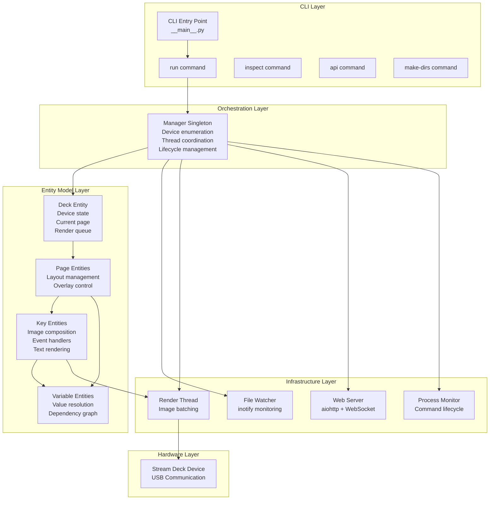
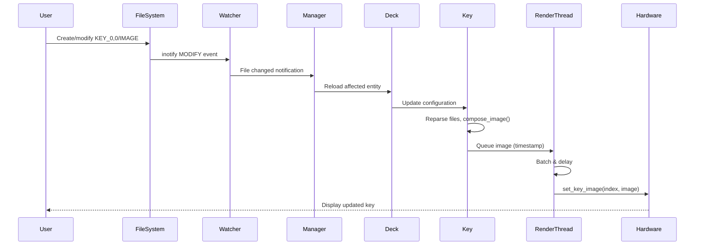
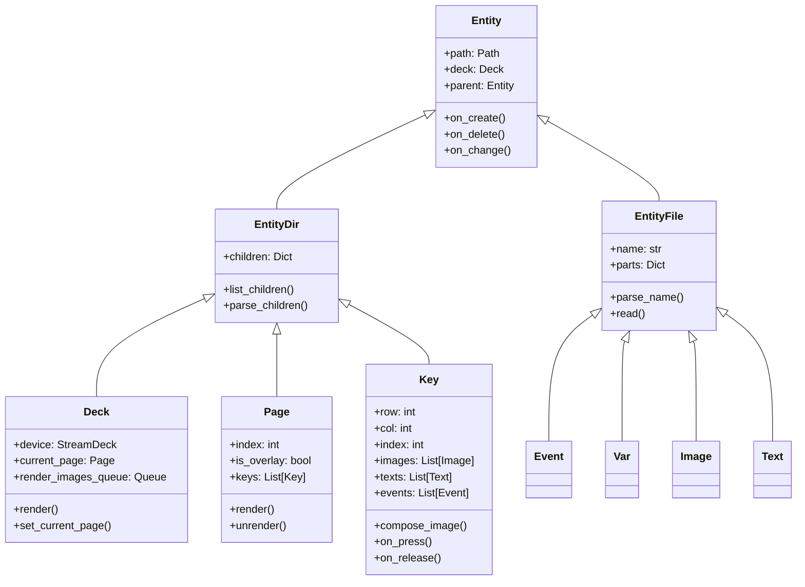
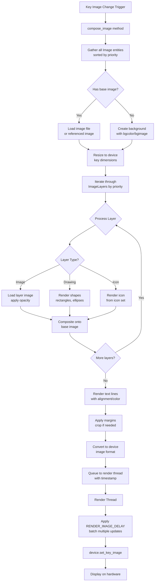
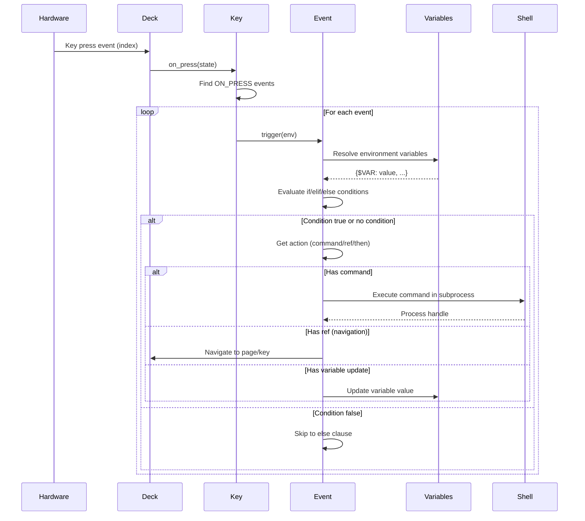
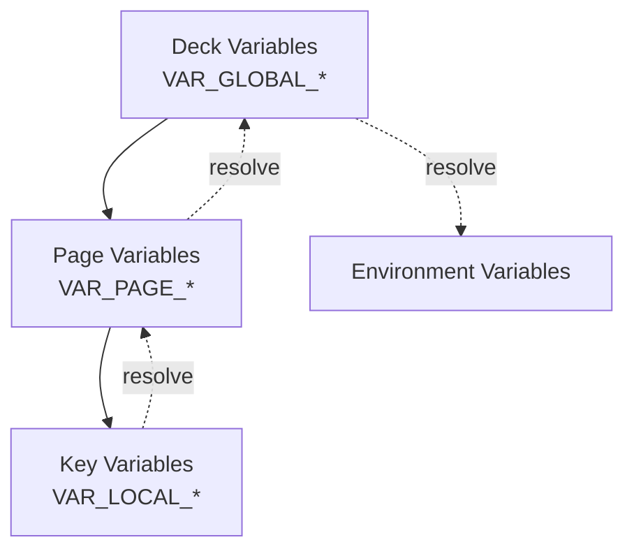
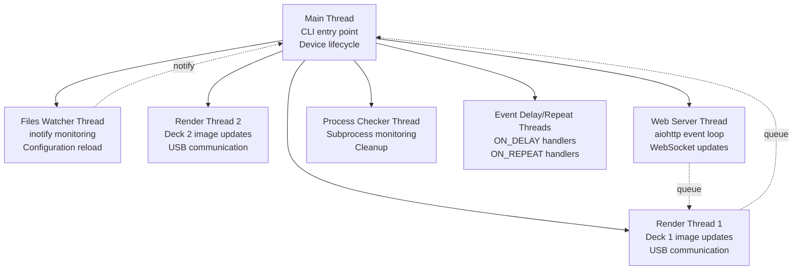
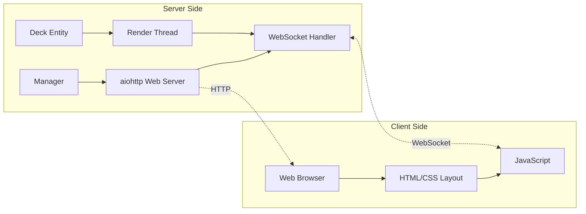
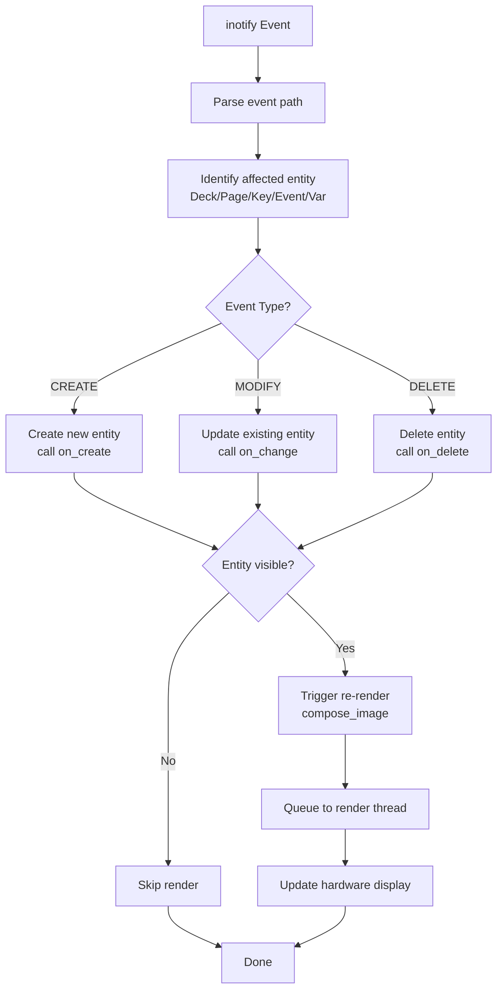

# StreamDeckFS Technical System Documentation

> **📚 Documentation Set:** This document covers the **system architecture and internal design**. For advanced features, API usage, real-world examples, and troubleshooting, see the [Advanced Features Guide](./advanced-features.md).

## Table of Contents

1. [Overview](#overview)
2. [Architecture](#architecture)
3. [Core Components](#core-components)
4. [Configuration Model](#configuration-model)
5. [Image Rendering Pipeline](#image-rendering-pipeline)
6. [Event Handling System](#event-handling-system)
7. [Variable System](#variable-system)
8. [Multi-Threading Architecture](#multi-threading-architecture)
9. [Web Virtual Decks](#web-virtual-decks)
10. [File Watching & Hot Reload](#file-watching--hot-reload)
11. [Design Patterns](#design-patterns)

---

## Overview

**StreamDeckFS** is a Python-based configuration system for Elgato Stream Deck devices that replaces traditional GUI configuration with a **filesystem-based approach**. Instead of using the official Elgato software, users create directories and files following specific naming conventions. The system monitors these files and automatically synchronizes changes to the connected hardware in real-time.

### Key Principles

- **Configuration as Code**: All settings stored as filesystem structures
- **Hot Reload**: Changes detected and applied instantly via inotify
- **Composability**: Images, text, events built from layers and components
- **Scriptability**: Full shell integration with command execution
- **Web Access**: Virtual decks accessible via browser with real-time updates
- **Version Control Friendly**: Plain text configuration suitable for Git

### Technology Stack

| Technology | Purpose |
|-----------|---------|
| Python 3.9+ | Core implementation |
| Click/Cloup | CLI framework |
| python-elgato-streamdeck | Hardware communication library |
| inotify-simple | Linux filesystem event monitoring |
| Pillow (PIL) | Image composition and manipulation |
| aiohttp | Async web server for virtual decks |
| Jinja2 | Web UI templating |
| NetworkX | Dependency graph for variable resolution |
| psutil | Process lifecycle management |

---

## Architecture

### High-Level System Architecture



### Component Interaction Flow



---

## Core Components

### 1. Manager (Singleton)

The **Manager** class (`manager.py`) is the central orchestrator of the entire system. It maintains global state and coordinates all subsystems.

**Responsibilities:**

- Device enumeration and connection management
- Thread lifecycle (watcher, renderer, web server, process checker)
- Deck instance creation and destruction
- Configuration directory monitoring
- Global event coordination

**Key Methods:**

- `get_device_class()`: Factory method for device instantiation
- `start_files_watcher()`: Initialize inotify monitoring
- `start_render_thread(deck)`: Create per-deck rendering thread
- `start_web_server()`: Launch aiohttp web interface
- `check_decks_and_directories()`: Main loop checking device/directory changes

### 2. Entity Hierarchy

The system uses a **three-tier entity model**:



**Entity Lifecycle:**

1. **Creation**: `on_create()` called when file/directory detected
2. **Parsing**: Configuration extracted from filenames and content
3. **Rendering**: Visual representation generated (for visible entities)
4. **Monitoring**: Changes detected via file watcher
5. **Update**: `on_change()` called on modification
6. **Deletion**: `on_delete()` called when file/directory removed

### 3. Deck Entity

Represents a physical Stream Deck device or web virtual deck.

**Key Properties:**

- `device`: Hardware device handle (from python-elgato-streamdeck)
- `current_page`: Currently visible page
- `pages`: Dictionary of all available pages
- `render_images_queue`: Thread-safe queue for rendering pipeline
- `vars`: Deck-level variables

**Lifecycle Methods:**

- `open_device()`: Establish USB connection, set brightness, register callbacks
- `close_device()`: Clean shutdown, clear display
- `set_current_page(page, overlay=False)`: Navigate between pages
- `render()`: Compose and display all keys on current page

### 4. Page Entity

Represents a layout of keys, either standalone or overlay.

**Configuration:**

- Directory name: `PAGE_N` or `PAGE_NAME` (optional `;overlay` suffix)
- Contains: Keys, page-level variables
- Special file: `.current_page` (marks active page on startup)

**Types:**

- **Standard Page**: Full layout replacing current display
- **Overlay Page**: Partial layout shown on top of current page

**Navigation:**

Pages support special navigation targets in events:
- `__first__`: Jump to first page
- `__back__`: Return to previous page (before overlay)
- `__prev__`: Previous page by index
- `__next__`: Next page by index

### 5. Key Entity

Represents a single button on the Stream Deck.

**Addressing:**

- Directory name: `KEY_row,col` (e.g., `KEY_0,0` for top-left)
- Alternative: `KEY_index` (linear index)
- Special: `KEY_ANY` (wildcard, responds to any unassigned key)

**Components:**

A key can contain:
- **Images**: Multiple layers composited together
- **Texts**: Multiple text lines with positioning
- **Events**: Press, release, long-press, repeat handlers
- **Variables**: Key-scoped variables

**Image Composition:**

Keys support layered images with priorities:
- `IMAGE` (no suffix): Priority 0
- `IMAGE_1`, `IMAGE_2`, etc.: Explicit priority
- Higher priority = rendered on top

---

## Configuration Model

### Filesystem Structure

The configuration is a **direct mapping** from filesystem hierarchy to runtime entities:

```
my-deck/                          # Serial number (e.g., CL12345678)
├── .model                        # Device model identifier
├── .brightness;value=75          # Global brightness setting
├── PAGE_0/                       # First page (standard)
│   ├── .current_page             # Marker for default page
│   ├── KEY_0,0/                  # Top-left key
│   │   ├── IMAGE                 # Base image file
│   │   ├── IMAGE_10;opacity=0.5  # Overlay image (priority 10)
│   │   ├── TEXT;line=0;text=Hello;color=#FFF;size=12
│   │   ├── TEXT;line=1;text=World;align=center
│   │   ├── ON_PRESS;command=echo "pressed"
│   │   ├── ON_RELEASE;if=$ENABLED;then=$PRESSED_PAGE:$PRESSED_KEY
│   │   └── ON_LONGPRESS;wait=500;command=shutdown now
│   ├── KEY_0,1/
│   └── VAR_TIMER;value=0         # Page-level variable
├── PAGE_1;overlay                # Overlay page
│   ├── KEY_2,2/                  # Only this key active in overlay
│   │   └── ON_PRESS;then=__back__
│   └── KEY_ANY/                  # Catch-all for other keys
│       └── ON_PRESS;then=__back__
└── VAR_GLOBAL_STATE;value=idle   # Deck-level variable
```

### Naming Convention Syntax

All configuration uses **semicolon-delimited key-value pairs** in filenames:

```
ENTITY_TYPE[_IDENTIFIER][;param1=value1][;param2=value2]...
```

**Examples:**

```
IMAGE;ref=/other_page:other_key;opacity=0.8;margin=5
TEXT;line=0;text=Status: $STATUS;color=#00FF00;align=center;size=14
ON_PRESS;if=$MODE == "active";then=page1;else=page2
VAR_COUNTER;value=0;type=int
KEY_0,0;disabled=true
```

### File Content vs Filename

- **Filename**: Structured parameters (parsed as key=value pairs)
- **File Content**:
  - Images: Binary image data (PNG, JPEG, BMP)
  - Text: Plain text content (alternative to `text=` parameter)
  - Events: Multi-line commands or complex scripts
  - Variables: Plain value (alternative to `value=` parameter)

### References

Keys can reference other keys' configuration using the `ref=` syntax:

```
ref=target_page:target_key
ref=/other_page:other_key          # Absolute reference
ref=:other_key                     # Same page reference
ref=other_page:                    # Reference to page (for navigation)
```

**Use Cases:**

- Template keys: Define once, reference many times
- Dynamic navigation: Change target based on variables
- Image reuse: Share images across multiple keys

---

## Image Rendering Pipeline

### Composition Process



### Rendering Thread

Each deck has a dedicated **rendering thread** to handle image updates:

**Why Threading?**

- **Decouples** image composition (CPU-intensive) from USB communication
- **Batches** rapid changes (e.g., animations, variable updates)
- **Reduces** USB bandwidth with configurable delay (`RENDER_IMAGE_DELAY`)
- **Prevents** blocking main event loop during rendering

**Queue-Based Design:**

```python
# Simplified rendering loop
while not stop_event.is_set():
    key_index, image, timestamp = render_queue.get()

    # Delay to batch updates
    time_since = time.time() - timestamp
    if time_since < RENDER_IMAGE_DELAY:
        sleep(RENDER_IMAGE_DELAY - time_since)

    # Send to hardware
    device.set_key_image(key_index, image)
```

### Image Layers

Images support **multiple layers** composited in priority order:

| Layer Type | Description | Parameters |
|-----------|-------------|------------|
| Base Image | Primary image from file | `ref=`, `opacity=`, `margin=` |
| Image Layer | Additional image overlays | `IMAGE_N`, priority via suffix |
| Background | Solid color or image | `bgcolor=`, `bgimage=` |
| Icon | Font-based icons | `icon=`, `icon_size=`, `icon_color=` |
| Drawing | Shapes and primitives | `draw=`, geometry params |
| Text | Rendered text lines | `TEXT;line=N`, formatting params |

**Example Multi-Layer Composition:**

```
KEY_0,0/
├── IMAGE;bgimage=background.png;opacity=0.3        # Layer 0: Faded background
├── IMAGE_5;ref=/templates:button_frame             # Layer 5: Button frame
├── IMAGE_10;icon=play;icon_size=32;icon_color=#FFF # Layer 10: Play icon
└── TEXT;line=0;text=Play;align=bottom;color=#FFF   # Top layer: Text
```

Result: Background → Frame → Icon → Text (bottom to top)

---

## Event Handling System

### Event Types

StreamDeckFS supports multiple event triggers per key:

| Event Type | Trigger | Parameters |
|-----------|---------|------------|
| `ON_PRESS` | Key pressed down | `command=`, `if/then/else`, `ref=` |
| `ON_RELEASE` | Key released | Same as ON_PRESS |
| `ON_LONGPRESS` | Held for duration | `wait=` (milliseconds) |
| `ON_REPEAT` | Repeating while held | `every=` (milliseconds) |
| `ON_DELAY` | Delayed execution | `wait=` (milliseconds) |

### Event Processing Flow



### Conditional Events

Events support **inline conditional logic**:

```
ON_PRESS;if=$MODE == "active";then=page_active;else=page_inactive
ON_PRESS;if=$VOLUME > 50;then=$HIGH_VOLUME_PAGE:$KEY;else=do_nothing
ON_RELEASE;if=$TIMER_RUNNING;elif=$TIMER_PAUSED;else=start_timer
```

**Syntax:**

- `if=expression`: Boolean condition (Python expression)
- `elif=expression`: Additional conditions (multiple allowed)
- `then=action`: Action if condition true
- `else=action`: Fallback action

**Supported Actions:**

- `command=shell_command`: Execute shell command
- `ref=page:key`: Navigate or trigger referenced key
- `page_name`: Navigate to page
- `__special__`: Special navigation (`__back__`, `__next__`, etc.)

### Command Execution

Events with `command=` parameter spawn subprocess:

```
ON_PRESS;command=playerctl play-pause
ON_PRESS;command=notify-send "Button pressed"
```

**Multi-line Commands:**

For complex scripts, use file content:

```bash
# File: ON_PRESS
#!/bin/bash
if pgrep obs > /dev/null; then
    obs-cmd recording toggle
else
    notify-send "OBS not running"
fi
```

**Environment Variables:**

Commands receive resolved variables as environment:

```
ON_PRESS;command=echo "Volume is $VOLUME"
```

The `$VOLUME` variable is resolved and passed as `VOLUME=50` to the subprocess.

### Long Press and Repeat

**Long Press:**

```
ON_LONGPRESS;wait=500;command=shutdown now
```

Triggers after key held for 500ms. Cancels regular `ON_PRESS` event.

**Repeat:**

```
ON_REPEAT;every=100;command=volume_up.sh
```

Triggers every 100ms while key held down. Useful for volume sliders, counters, etc.

**Delay:**

```
ON_DELAY;wait=1000;command=cleanup.sh
```

Triggers after 1000ms, runs once. Independent of key state.

---

## Variable System

### Variable Scopes

Variables follow a **hierarchical scoping** model:



**Resolution Order:**

1. Key-scoped variables
2. Page-scoped variables (current page)
3. Deck-scoped variables
4. System environment variables

### Variable Definition

**Simple Value:**

```
VAR_COUNTER;value=0
VAR_STATUS;value=idle
VAR_BRIGHTNESS;value=75
```

**File Content:**

```
VAR_CONFIG;file=/path/to/config.json
```

Reads file content as variable value. Watches file for changes.

**Shell Substitution:**

```
VAR_VOLUME;value=$(pactl get-sink-volume @DEFAULT_SINK@ | grep -oP '\d+%' | head -1)
```

**Conditional Variables:**

```
VAR_COLOR;if=$ACTIVE;then=#00FF00;else=#FF0000
VAR_TEXT;if=$MODE == "play";then=Playing;elif=$MODE == "pause";then=Paused;else=Stopped
```

### Variable References

Variables can reference other variables, creating a **dependency graph**:

```
VAR_A;value=10
VAR_B;value=$A * 2                    # B = 20
VAR_C;value=$A + $B                   # C = 30
VAR_DISPLAY;value=Total: $C           # DISPLAY = "Total: 30"
```

**Cascading Updates:**

When `VAR_A` changes:
1. `VAR_A` updated
2. Dependency graph traversed (using NetworkX)
3. `VAR_B` recalculated
4. `VAR_C` recalculated
5. `VAR_DISPLAY` recalculated
6. All keys using these variables re-rendered

### Special Variables

The system provides **built-in variables**:

| Variable | Description | Example |
|----------|-------------|---------|
| `$PRESSED_PAGE` | Page where key was pressed | `PAGE_0` |
| `$PRESSED_KEY` | Key identifier that was pressed | `KEY_0,0` |
| `$CURRENT_PAGE` | Currently visible page | `PAGE_1` |
| `$DECK_MODEL` | Device model | `StreamDeck Original` |
| `$DECK_SERIAL` | Device serial number | `CL12345678` |
| `$KEY_INDEX` | Linear key index (0-based) | `5` |
| `$KEY_INDEX0` | Same as KEY_INDEX | `5` |

**Usage in Events:**

```
ON_PRESS;then=$PRESSED_PAGE:$PRESSED_KEY  # Navigate back to self
ON_RELEASE;command=echo "Page: $CURRENT_PAGE, Key: $KEY_INDEX"
```

### Expression Evaluation

Variable values support **Python expressions**:

```
VAR_CALC;value=($A + $B) * $C / 100
VAR_BOOL;value=$X > 10 and $Y < 20
VAR_STRING;value=f"Status: {$STATUS} at {$TIME}"
```

**Supported Operations:**

- Arithmetic: `+`, `-`, `*`, `/`, `//`, `%`, `**`
- Comparison: `==`, `!=`, `<`, `>`, `<=`, `>=`
- Logical: `and`, `or`, `not`
- String: `f-strings`, concatenation, methods

**Safety:**

Expressions evaluated in restricted namespace (no `exec`, `eval`, file access for security).

---

## Multi-Threading Architecture

### Thread Overview



### Thread Responsibilities

| Thread | Purpose | Termination |
|--------|---------|-------------|
| **Main Thread** | Device detection, lifecycle control, main loop | User SIGINT (Ctrl+C) |
| **Files Watcher** | Monitor filesystem with inotify, reload entities | `stop_event.set()` |
| **Render Thread(s)** | Per-deck image rendering with batching | `stop_event.set()` |
| **Web Server** | HTTP requests, WebSocket connections | `runner.cleanup()` |
| **Process Checker** | Monitor spawned subprocesses, cleanup zombies | `stop_event.set()` |
| **Event Threads** | Handle delayed/repeated events | Event completion or cancel |

### Thread Communication

**Queue-Based:**

- `render_images_queue`: Main → Render thread (images to display)
- `to_web_queue`: Render → Web thread (images for virtual decks)

**Event-Based:**

- `threading.Event`: Global stop signal for graceful shutdown

**Shared State:**

- `Manager` singleton: Thread-safe access to decks, devices
- Entity tree: Read-mostly, updates synchronized via file watcher

### Synchronization Strategy

**Lock-Free Design:**

The system minimizes locking through:

1. **Single Writer**: File watcher is only thread modifying entity tree
2. **Immutable Reads**: Most threads only read entity configuration
3. **Queue Communication**: Producer-consumer pattern for image updates
4. **Event Signaling**: Shutdown coordination without locks

**Critical Sections:**

Minimal locking used only for:
- Device enumeration (listing connected Stream Decks)
- Queue operations (handled by `queue.SimpleQueue`)
- Web server route registration

---

## Web Virtual Decks

### Purpose

Web virtual decks allow **browser-based access** to Stream Deck interfaces:

- View deck state remotely
- Control from tablet/phone
- Create custom layouts not matching physical hardware
- Multiple virtual decks per physical device

### Architecture



### Web Deck Configuration

Created with `create-web-deck` command:

```bash
streamdeckfs create-web-deck \
    --serial WEB_CUSTOM \
    --model streamdeck_original \
    --rows 3 \
    --cols 5 \
    /path/to/config/
```

Creates virtual deck directory:

```
WEB_CUSTOM/
├── .model;web=true
└── PAGE_0/
    └── (keys as usual)
```

The `.model;web=true` marks it as virtual (no physical device required).

### Real-Time Updates

**WebSocket Protocol:**

1. Client connects: `ws://server/WEB_CUSTOM`
2. Server sends initial deck state (all key images as base64)
3. On key image change:
   - Render thread queues to `to_web_queue`
   - Web thread sends WebSocket message: `{"key": index, "image": base64_data}`
4. Client updates DOM with new image

**Image Encoding:**

```python
# Server-side
buffered = BytesIO()
image.save(buffered, format="PNG")
img_base64 = base64.b64encode(buffered.getvalue()).decode()

# Client-side JavaScript
ws.onmessage = (event) => {
    const data = JSON.parse(event.data);
    const img = document.getElementById(`key-${data.key}`);
    img.src = `data:image/png;base64,${data.image}`;
};
```

### Authentication

Optional password protection:

```bash
streamdeckfs run /config --web --web-password mysecret
```

Uses session-based authentication (stored in cookies).

### SSL/TLS Support

For secure remote access:

```bash
streamdeckfs run /config --web \
    --ssl-cert /path/to/cert.pem \
    --ssl-key /path/to/key.pem
```

Enables `https://` and `wss://` (WebSocket Secure).

---

## File Watching & Hot Reload

### inotify Integration

**Linux Kernel Integration:**

Uses `inotify` via `inotify-simple` library for efficient filesystem monitoring:

```python
inotify = INotify()
watch_flags = flags.CREATE | flags.DELETE | flags.MODIFY | flags.MOVED_TO | flags.MOVED_FROM

for directory in watched_directories:
    inotify.add_watch(directory, watch_flags)
```

**Watched Events:**

| inotify Event | Action |
|--------------|--------|
| `CREATE` | New file/directory → Create entity |
| `DELETE` | File/directory removed → Delete entity |
| `MODIFY` | File content changed → Update entity |
| `MOVED_TO` | File moved into watched dir → Create entity |
| `MOVED_FROM` | File moved out → Delete entity |

### Watch Strategy

**Recursive Watching:**

The system watches:
1. All deck directories (e.g., `/config/CL12345678/`)
2. All page directories (e.g., `/config/CL12345678/PAGE_0/`)
3. All key directories (e.g., `/config/CL12345678/PAGE_0/KEY_0,0/`)

**Dynamic Watch Registration:**

When a new page directory is created, the watcher automatically adds it to the watch list.

### Entity Reload Process



### Version Management

**Multi-Version Entities:**

During file transitions (e.g., renaming), multiple versions of an entity may exist temporarily:

```python
# versions dict allows coexistence
deck.pages = {
    'PAGE_0': page_v1,  # Old version
    'PAGE_0': page_v2,  # New version (replaces)
}
```

This prevents race conditions during rapid file changes.

### Debouncing

**RENDER_IMAGE_DELAY:**

Configurable delay (default: 50ms) prevents excessive rendering during rapid changes:

```python
# Multiple image updates within 50ms → single render
timestamp = time.time()
queue.put((key_index, image, timestamp))

# Render thread waits
elapsed = time.time() - timestamp
if elapsed < RENDER_IMAGE_DELAY:
    sleep(RENDER_IMAGE_DELAY - elapsed)
```

This optimizes:
- Text editors saving temporary files
- Scripts modifying multiple files
- Variable cascades updating many keys

---

## Design Patterns

### 1. Singleton Pattern

**Manager Class:**

```python
class Manager:
    _instance = None

    def __new__(cls):
        if cls._instance is None:
            cls._instance = super().__new__(cls)
        return cls._instance
```

Ensures single point of coordination for all decks, threads, and devices.

### 2. Entity-Component Pattern

**Hierarchical Entities:**

- `Deck` contains `Pages`
- `Page` contains `Keys`
- `Key` contains `Images`, `Texts`, `Events`

Each entity is self-contained with lifecycle methods (`on_create`, `on_delete`, `on_change`).

### 3. Factory Pattern

**Device Instantiation:**

```python
def get_device_class(model):
    return {
        'streamdeck_original': StreamDeckOriginal,
        'streamdeck_mini': StreamDeckMini,
        'streamdeck_xl': StreamDeckXL,
        # ...
    }.get(model)
```

Abstracts device-specific implementations.

### 4. Observer Pattern

**File Watcher:**

```python
# Watcher observes filesystem
watcher.add_watch(directory, callback=entity.on_change)

# Entity reacts to changes
def on_change(self):
    self.parse()
    self.render()
```

Decouples filesystem events from entity updates.

### 5. Queue-Based Producer-Consumer

**Rendering Pipeline:**

```python
# Producer (Key)
self.deck.render_images_queue.put((self.index, image, timestamp))

# Consumer (Render Thread)
while True:
    key_index, image, timestamp = queue.get()
    device.set_key_image(key_index, image)
```

Decouples image composition from hardware communication.

### 6. Template Method Pattern

**Entity Base Classes:**

```python
class Entity:
    def on_create(self):
        self.parse()  # Overridden by subclass
        self.setup()  # Common logic

    def parse(self):
        raise NotImplementedError
```

Subclasses override specific methods while inheriting common behavior.

### 7. Lazy Initialization

**Cached Properties:**

```python
from cached_property import cached_property

class Key:
    @cached_property
    def composed_image(self):
        # Expensive image composition
        return self.compose_image()
```

Defers expensive operations until needed, caches result.

### 8. Dependency Injection

**Deck Reference:**

Every entity receives `deck` parameter, allowing access to shared state without globals:

```python
class Key(EntityDir):
    def __init__(self, deck, parent, path):
        self.deck = deck  # Injected dependency
        self.parent = parent
        # ...
```

### 9. State Pattern

**Page Navigation:**

```python
# Current page state
deck.current_page = page1

# State transition
deck.set_current_page(page2)
# → page1.unrender()
# → page2.render()
```

Encapsulates state-specific behavior in Page class.

### 10. Command Pattern

**Event System:**

```python
class Event:
    def trigger(self, env):
        if self.command:
            subprocess.Popen(self.command, env=env)
        elif self.ref:
            self.navigate(self.ref)
```

Encapsulates actions as objects, supports undo/redo, queuing.

---

## Conclusion

StreamDeckFS is a **sophisticated configuration system** that transforms filesystem operations into hardware interactions. Its architecture elegantly separates concerns:

- **Configuration** stored as directory structures
- **Monitoring** via inotify file watching
- **Composition** through layered image rendering
- **Execution** via multi-threaded pipeline
- **Communication** through queues and events

The system is designed for:
- **Flexibility**: Any layout configurable via files
- **Performance**: Threaded rendering, batched updates
- **Reliability**: Graceful degradation, error recovery
- **Extensibility**: Plugin-friendly entity system

This architecture makes StreamDeckFS suitable for:
- Home automation control panels
- Streaming/content creation setups
- Development environment shortcuts
- Custom productivity tools
- Any scenario requiring physical button interfaces

The codebase demonstrates professional software engineering practices: clear separation of concerns, appropriate design patterns, thread safety, and maintainable structure.

---

## Next Steps

This document covered the **internal architecture and design** of StreamDeckFS. To continue your journey:

### For Advanced Usage
📖 **[Advanced Features Guide](./advanced-features.md)** - Comprehensive guide covering:
- REST API for programmatic control
- Drawing system for dynamic graphics
- Advanced variable expressions and logic
- Complete real-world use cases (Pomodoro, Stopwatch, Media Control)
- Hardware compatibility and troubleshooting
- Performance optimization and security

### For Practical Examples
📁 **[Examples Directory](../../examples/)** - Working configurations:
- Pomodoro timer implementation
- Stopwatch with state machine
- Additional community examples

### For Project Information
📘 **[Main README](../../README.md)** - Project overview, installation, and quick start
